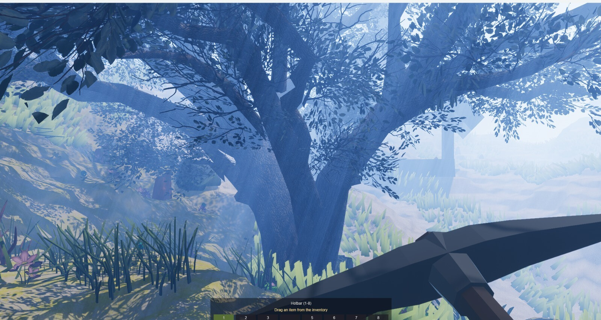
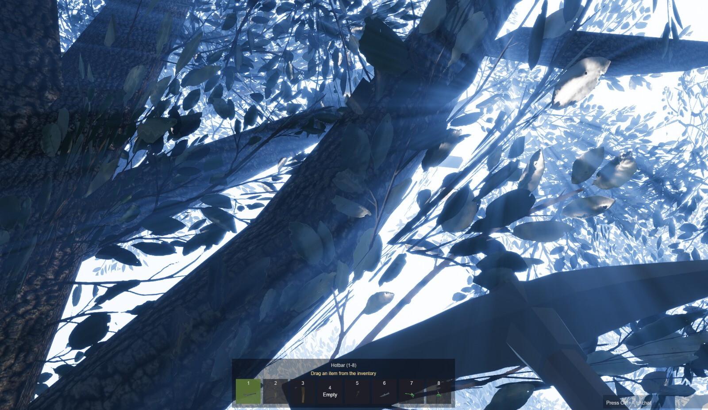
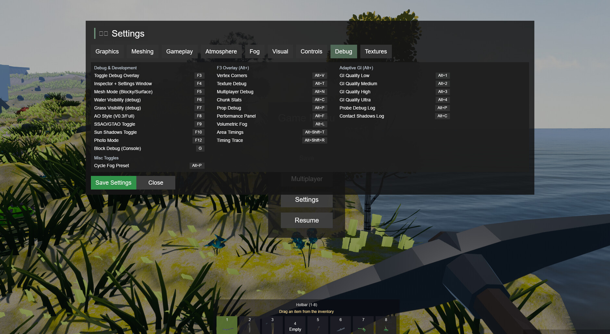
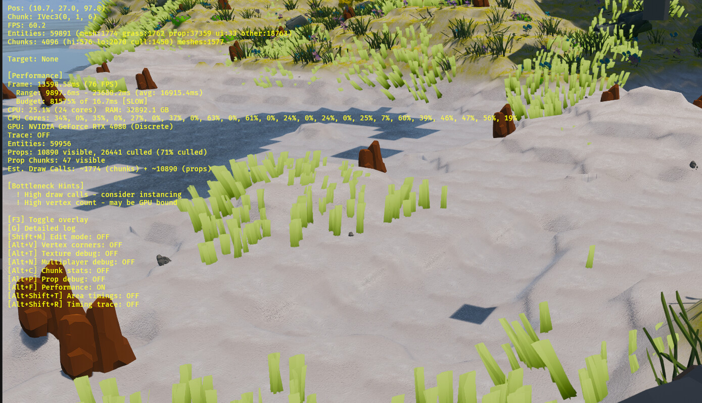
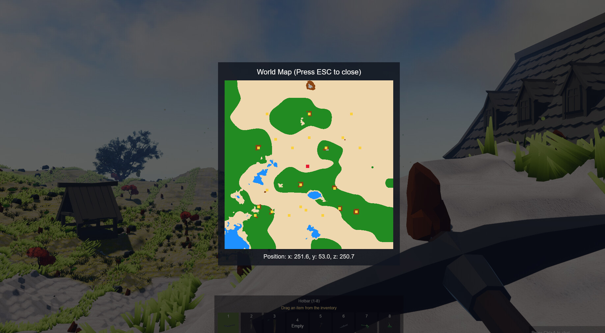
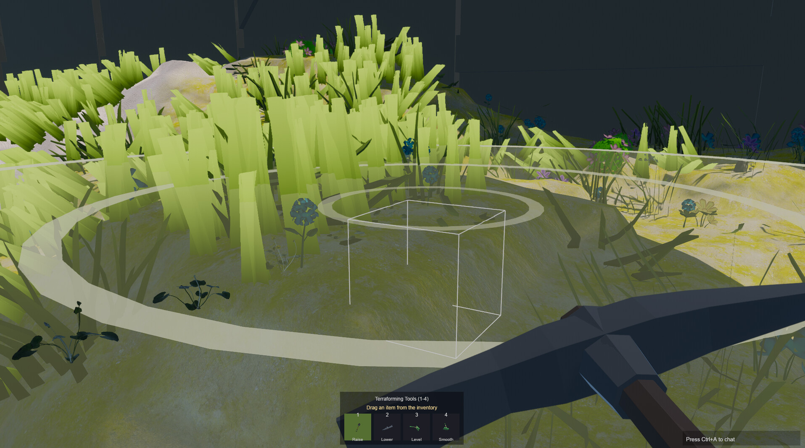
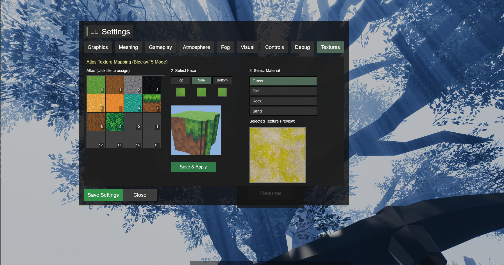
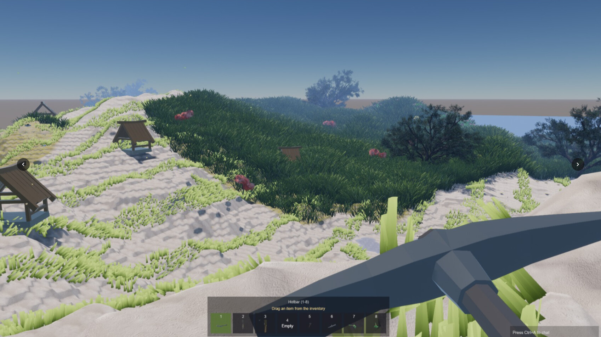

# Drusniel Voxels

## Version History

Current development version: **v0.5**.

### Current (v0.5)

*   **Valheim-Style Water Rendering Overhaul**: Complete rewrite of the water shader pipeline with physically-based wave physics, multi-layer foam, caustics, Fresnel reflections, refraction, and interactive displacement.

    *   **Gerstner Wave Normals**: Replaced the old finite-difference normal approximation with analytical Gerstner wave normals (`gerstner_waves.wgsl`). Four-layer Gerstner summation produces physically accurate wave crests, troughs, and foam buildup — foam accumulates on wave peaks and propagates to shorelines.

    *   **Multi-Scale Voronoi Foam** (`water_foam.wgsl`): Three-scale foam noise (large/medium/small Voronoi) with animated sparkle highlights. Combines depth-based shoreline foam with wave-crest foam driven by the Gerstner `foam` output. Fully replaces the old inline foam constants.

    *   **Detail Normal Maps** (`water_detail_normals.wgsl`): Two independently-scrolling tiling normal map layers blended via UDN (Unreal-style Derivative Normal blending) for fine-scale ripple texture. Distance fade at 40–80m prevents aliasing. Guarded by `#ifdef WATER_DETAIL_NORMALS` and disabled on integrated GPUs.

    *   **Underwater Caustics** (`water_caustics.wgsl`): Sine-wave + Voronoi caustic patterns projected onto terrain below `WATER_LEVEL`. Active in both triplanar (smooth terrain) and blocky (voxel) shaders. Depth-attenuated so caustics fade out in deep water.

    *   **Planar Reflection Camera** (`water_reflection.rs`): A dedicated half-resolution (`960×540`) camera renders the scene mirrored across the water plane (`Y = WATER_LEVEL`). Mirror transform flips both position and pitch. Temporal amortization support (render every N frames). Disabled automatically on integrated GPUs. **RenderLayers-based culling** excludes below-water terrain chunks from the reflection camera — only chunks whose top face is above `WATER_LEVEL` are visible, preventing underwater geometry from appearing in reflections.

    *   **Reflection Compositor** (`water_reflection_compositor.rs`): A custom post-process render graph node inserted between `EndMainPass` and `Bloom`. Reconstructs world-Y from the depth prepass to identify water-surface pixels, then blends the planar reflection texture using Schlick Fresnel (power 5.0) with wave-driven UV distortion. Bypasses the `bevy_water` material binding limitation by compositing reflections after the main pass. No-op when reflections are disabled.

    *   **Fresnel Reflection Blending**: Schlick Fresnel drives view-angle dependent reflection strength — at glancing angles the water surface becomes a mirror; at steep angles it's transparent. Includes an approximated sun specular highlight in the reflected direction. Alpha also increases at glancing angles (physically correct — water becomes opaque when viewed at a shallow angle).

    *   **Screen-Space Refraction**: Enabled Bevy's built-in `specular_transmission = 0.2`, `ior = 1.33` (water's physical IOR), and `thickness = 0.5` on the water `StandardMaterial`. The Gerstner wave normals drive the transmission distortion direction, creating the characteristic underwater wobble of light refracted through a moving surface.

    *   **Interactive Displacement System** (`water_displacement.rs`): CPU-driven 256×256 wave physics simulation using the discrete 2D wave equation (height + velocity fields, ~0.3 ms/frame). Objects with a `WaterImpulseSource` component (e.g. the player) inject circular impulses when moving through water; the wave equation propagates them outward with configurable speed and damping. The result is uploaded to a `WaterDisplacementTexture` each frame. Also exposes `sample_water_displacement()` for accurate buoyancy height queries from physics code.

    *   **Config-Driven**: All parameters tunable in `assets/config/water.yaml` — wave speed/damping, reflection resolution scale, detail normal intensity, caustic strength, Fresnel power, foam scale, etc.

    *   **GPU Fallback**: Planar reflections, detail normals, and displacement are all automatically disabled on integrated GPUs via the existing `GraphicsCapabilities::integrated_gpu` flag.

*   **Performance Optimization Sweep**: Systematic GPU/CPU cost reduction across all major rendering and simulation systems, using distance-based culling, budget limiting, and quality scaling.

    *   **Shadow Budget System** (`rendering/shadow_budget.rs`): New distance-based shadow culling for terrain chunks — chunks beyond 192m get `NotShadowCaster` added (with 16m hysteresis). Point light shadow budget limits concurrent shadow-casting lights to the 4 closest within 80m. Water meshes permanently marked `NotShadowCaster` (translucent surfaces shouldn't cast opaque shadows). Shadow stats shown in F3 debug overlay.

    *   **Cascade Shadow Tightening**: Directional light cascade max distance reduced from 1024m to 256m — 4× better shadow texel density at the same 4096² resolution. Integrated GPUs get further reduction (2 cascades, 96m range).

    *   **Grass Distance Culling**: New distance-aware grass system — grass patches cull entirely beyond 128m, density reduces at 64–96m, with hysteresis to prevent pop-in. A periodic `cull_distant_grass` system despawns patches on chunks the player moves away from, reclaiming draw calls.

    *   **Water Reflection Optimization**: Reflection camera now renders every 2nd frame (temporal amortization). Resolution reduced from 0.5× to 0.35× (672×378). Render distance tightened from 200m to 150m. Reflections are inherently distorted so the quality impact is minimal.

    *   **Water Displacement Throttle**: CPU wave simulation (`256×256` grid) now runs every 2nd frame instead of every frame. Adds a "settled" check that skips simulation entirely when no active impulses and all energy has damped below threshold — saves ~0.15ms/frame when idle.

    *   **Volumetric Fog / God Rays**: Default step counts halved from 64 to 32 for both volumetric fog raymarching and screen-space god ray radial blur samples. Barely visible quality difference outdoors.

    *   **Volumetric Cloud Optimization**: Primary raymarching steps reduced from 64 to 32, render scale from 0.5× to 0.25× (quarter resolution). Temporal reprojection compensates for the lower sample count.

    *   **Prop LOD Improvements**: Material LOD now enabled by default (distant props skip PBR normal maps). Shadow cull distance tightened from 80m to 64m. Base view distance reduced from 350m to 280m. Billboard switch distance tightened from 250m to 180m. Flower visibility multiplier reduced (0.35→0.25).

    *   **Terrain Cull Distance**: High-detail distance reduced from 160m to 128m (aligned with shadow cull). Overall cull distance tightened from 400m to 320m (fog hides terrain beyond ~220m).

### Current (v0.4-dev)
*   **Bevy 0.18 Rendering Stack**: HDR pipeline with tonemapping, bloom, debanding, and color grading on the main camera.
*   **Radiance Cascades GI**: Screen-space global illumination using voxel SDF data for efficient ray marching, providing realistic indirect lighting with multi-cascade probe system and temporal reprojection.
*   **Adaptive GI Enhancements**: Stochastic one-from-eight probe selection (~8x GI performance gain at Low quality), SDF-based terrain shadows leveraging voxel data, and screen-screen contact shadows for vegetation micro-detail. Quality presets (Low/Medium/High/Ultra) with ~15% performance range. Toggle with Alt+1/2/3/4, debug with Alt+P.
*   **Aerial Perspective**: Custom shaders (buildings, props, grass) now blend toward fog color at distance, matching terrain fog behavior for consistent atmospheric depth.
*   **Environment Map Lighting**: Skybox-based IBL (Image-Based Lighting) for improved PBR reflections and ambient lighting that tracks time-of-day.
*   **Ambient + Atmospheric Effects**: GTAO (Ground Truth Ambient Occlusion via XeGTAO port), PCSS soft shadows, distance + volumetric fog with atmospheric falloff, and time-of-day color blending.
*   **Volumetric Clouds**: Raymarched volumetric clouds with temporal reprojection, Henyey-Greenstein scattering, and configurable cloud types (stratus/stratocumulus/cumulus).
*   **Enhanced Water** *(superseded by v0.5 water overhaul)*: Initial Gerstner wave simulation with foam generation and caustic effects.
*   **Weather Particles**: GPU-accelerated weather system (rain/snow/dust) via bevy_hanabi with camera-following emitters.
*   **Vegetation Wind**: Multi-layer wind animation for vegetation (trunk sway, branch movement, leaf flutter) with configurable presets. Enhanced grass shader with SSS (subsurface scattering) and contact shadows for realistic foliage rendering.
*   **Wind + Foliage Notes**: Detailed write-up on segmented tree bending, UV-based leaf flutter, and depth pre-pass optimization for alpha-cutout foliage in [docs/wind-foliage-depth-prepass.md](docs/wind-foliage-depth-prepass.md).
*   **Vegetation Alpha Fade**: Grass-like props fade to a configurable minimum alpha near the camera to keep visibility through dense foliage. Tuned in the F4 settings.
*   **Shadow + LOD Alignment**: Cascade shadows tuned to fog visibility and chunk LOD cull distances to avoid dark banding.
*   **Texture Quality**: Texture arrays with mipmaps and anisotropic filtering for terrain, plus expanded PBR materials for buildings/props.
*   **Chunk LOD System**: High/low/culled LODs with skirts for seam hiding and integrated GPU fallbacks.
*   **Prop LOD System**: Multi-level LOD for props with billboard and mesh decimation support:
    *   **Billboard LOD**: Distant trees rendered as axial (Y-axis rotation) billboards for ~95% vertex reduction. Distance-based switching with hysteresis to prevent flickering.
    *   **Mesh Decimation**: Vertex clustering algorithm creates LOD1 (50%) and LOD2 (75%) decimated mesh variants at load time for mid-distance props.
    *   **Extended View Distance**: Props now visible up to 350-420 units (trees furthest) to reduce pop-in.
*   **Snap Point Building System**: Enshrouded-style modular construction with automatic piece alignment:
    *   **Snap Point Detection**: Spatial hash index for O(1) queries finds compatible connection points within 0.75m radius.
    *   **Snap Groups**: Compatibility rules (FloorEdge↔WallBottom, WallSide↔WallSide, etc.) ensure pieces connect logically.
    *   **Ghost Preview**: Color-coded placement preview (green=valid, red=invalid, blue=snapped) with gizmo visualization.
    *   **Piece Registry**: Extensible registry with predefined pieces (floors, walls, fences, pillars) and configurable snap points.
    *   **Snap Toggle**: Press X to toggle snap mode on/off for free placement when needed.
*   **Meshing Settings**: Greedy meshing toggle in Settings > Meshing (runtime flag; algorithm integration pending).
*   **Config-Driven Tuning**: YAML configs for fog, AO, terrain generation, props, camera exposure, clouds, water, wind, weather, and GI.
*   **World + Tools**: Save/load persistence, minimap, and debug overlays.
*   **Enhanced Terrain Tools**: Gradual sculpting (Raise/Lower/Level/Smooth) with brush size/strength controls and visual preview cursor. Toggled via T key with dedicated hotbar UI.
*   **UI + Modes**: Settings menu (graphics/meshing/gameplay/atmosphere/fog/visual), map overlay, inventory/hotbar, chat overlay, and photo mode (DoF/motion blur).
*   **Prop Persistence System**: Calculate-once, persist-forever prop placement with multi-sample terrain analysis, slope-based rotation, and chunk-based JSON storage. Props are precisely placed using 5-point sampling for accurate ground contact, then saved to `saves/props/` for instant loading on subsequent runs. Supports dirty chunk regeneration when terrain is modified.

Examples of volumetric fog in this version (toggle with Alt+L; parameters are tunable in the Settings > Fog menu):




Debug overlay examples (toggle with F3; sub-toggles are listed in the Debug tab):




Minimap example (toggle with M):



Terraforming tools in action (toggle with T):
*   **Terrain Conform**: Props like buildings now automatically flatten the terrain beneath them for seamless integration.
*   **Sculpting**: Improved brush controls for raising, lowering, leveling, and smoothing terrain.



New Atlas Texture Mapping UI (Settings > Textures):
*   **Live Editing**: Reassign block face mappings (Top/Side/Bottom) in real-time.
*   **3D Preview**: Visualize changes instantly on a rotating 3D block preview.
*   **Visual Picker**: Select atlas tiles directly from a visual grid instead of guessing indices.



Props and vegetation with LOD optimizations:



#### Known Issues (v0.4)
*   **Volumetric Fog Performance**: Volumetric fog can cause significant frame drops, especially on mid-tier GPUs.
*   **God Rays With fog**: God ray/volumetric light shaft effect is only happening with fog around, we don't want to have that always.
*   **Mesh gaps**: Small gaps happening sometimes.
*   **Culling on close distance**: When digging and there are close distance polygons, culling and visibility has issues.
*   **Shallow water**: Shore foam, edge coloring, and caustics improved in v0.5.
*   **LODS**: Small gaps and errors can be seen far away in the LODs.

### V0.3
*   **PBR Materials & Parallax Mapping**: Implemented PBR material blending and parallax occlusion mapping, specifically enhancing rock textures.
*   **Texture Splatting**: Added smooth triplanar material blending (texture splatting) using vertex weights for seamless terrain transitions.
*   **Surface Nets Improvements**: Addressed chunk seams and fixed UV mapping/repeat samplers for surface nets.
*   **Material & Mesh Updates**: Ongoing updates to materials and mesh generation.

*   **Smooth Slope Movement**: Enhanced character controller with bilinear terrain height detection and step-up logic for fluid movement over terrain.


### V0.2
*   **Procedural Generation**: Added procedural grass mesh patches.
*   **Terrain & Environment**: Adjusted terrain balance by reducing sand beach areas; tweaked lighting and reintroduced water rendering.
*   **Assets**: Integrated new texture assets (PNG files).
*   **Rendering**: Improved visual fidelity with lighting adjustments.


### V0.1
*   **Core Systems**: Initial implementation work.
*   **Chunk Rendering**: Fixed visibility issues with chunk boundary faces.
*   **Modesty Fix**: Adjustments for content appropriateness for tilable terrain.


## Controls

### General
*   **Escape**: Toggle Pause Menu / Close Chat
*   **M**: Toggle Map Overlay
*   **Shift + M**: Toggle Edit Mode

### Debug & Development
*   **F3**: Toggle Debug Overlay (FPS, position, chunk stats, targeted block info)
*   **F4**: Toggle Inspector & Settings Window (LOD sliders, vegetation tweaks, foliage alpha fade, AO strength)
*   **F5**: Toggle Mesh Mode (Blocky ↔ SurfaceNets)
*   **F6**: Toggle Water Visibility (debug builds only)
*   **F7**: Toggle Grass Visibility (debug builds only)
*   **F8**: Toggle Terrain AO Style (V0.3 soft ↔ Full baked AO)
*   **F9**: Toggle Ambient Occlusion (SSAO & GTAO)
*   **F10**: Toggle Sun Shadows (Cascaded Shadow Maps)
*   **F12**: Toggle Photo Mode (DoF, motion blur)
*   **G**: Print Detailed Block Debug Info to Console

#### F3 Overlay Sub-toggles (all use Alt+)
*   **Alt+V**: Toggle Vertex Corners Display
*   **Alt+T**: Toggle Texture Debug Details
*   **Alt+N**: Toggle Multiplayer Debug Info
*   **Alt+C**: Toggle Chunk Statistics (uniformity, LOD, mesh counts)
*   **Alt+P**: Toggle Prop Debug (targeted prop, alpha/fade info)

#### Adaptive GI Controls (Alt+)
*   **Alt+1**: Low Quality (Approx. 8x faster, Contact Shadows OFF)
*   **Alt+2**: Medium Quality
*   **Alt+3**: High Quality (Default, Contact Shadows ON)
*   **Alt+4**: Ultra Quality
*   **Alt+P**: Toggle Probe Selection Debug Log
*   **Alt+C**: Toggle Contact Shadows Debug Log (in console)


### Movement
*   **W / A / S / D**: Move Forward, Left, Back, Right
*   **Space**: Jump (Walk Mode) / Fly Up (Fly Mode)
*   **Left Shift**: Sprint (Walk Mode) / Fly Down (Fly Mode)
*   **Left Ctrl**: Turbo Speed (Fly Mode)
*   **Tab**: Toggle Fly/Walk Mode
*   **R**: Reset Position to Spawn

### Interaction
*   **Left Click**: Break Block / Attack Entity
*   **Right Click**: Place Block

### Terraforming Mode (Toggle with T)
*   **T**: Toggle Mode (Switch Hotbar)
*   **1**: Raise Tool
*   **2**: Lower Tool
*   **3**: Level Tool (Right-click to set target height)
*   **4**: Smooth Tool
*   **Left Click**: Apply Tool
*   **Shift + Scroll**: Adjust Brush Radius
*   **Ctrl + Scroll**: Adjust Brush Strength

### Edit Mode (Toggle with Shift + M)
*   **Left Click + Drag**: Move Block
*   **Q / E** or **Mouse Wheel**: Rotate Dragged Block
*   **Delete**: Toggle Delete Mode
    *   **Left Click**: Delete Block (while in Delete Mode)

### Building Mode (Toggle with B to open Palette)
*   **B**: Open/Close Placement Palette
*   **Arrow Up/Down**: Navigate palette items
*   **Enter**: Select highlighted item
*   **X**: Toggle Snap Mode (snap to existing pieces vs free placement)
*   **R**: Rotate piece 90° (when placing)
*   **Right Click**: Place building piece
*   **Escape**: Close palette

Building pieces available in palette:
*   Wood Floor 2x2 (Foundation)
*   Wood Wall (2m × 2m)
*   Wood Fence (2m × 1m)
*   Wood Pillar (support column)

### Photo Mode (Toggle with F12)
*   **Mouse Wheel**: Adjust Focus Distance
*   **Q / E**: Adjust Aperture (f-stops)

### Chat
*   **Ctrl + A**: Open Chat
*   **Enter**: Send Message

## Free Texture Sources Guide

All sources are CC0 (public domain) - no attribution required.

---

## Primary Sources

| Source | Style | Best For | URL |
|--------|-------|----------|-----|
| **3DTextures.me** | Stylized/Hand-painted | Buildings, Props | https://3dtextures.me/category/stylized-textures/ |
| **Poly Haven** | Photorealistic | Terrain (modify for stylized) | https://polyhaven.com/textures |
| **ambientCG** | Photorealistic PBR | Ground, Rocks | https://ambientcg.com/ |
| **CGBookcase** | Photorealistic | Stone, Brick | https://www.cgbookcase.com/textures |
| **FreeStylized** | Stylized | Buildings, Environment | https://freestylized.com/all-textures/ |

---

## Buildings (Full PBR)

Download from **3DTextures.me** - already stylized with all maps included.

### Wood Planks
**Source:** https://3dtextures.me/2022/02/23/stylized-wood-wall-001/
```
Download -> Rename files:
  Stylized_Wood_Wall_001_basecolor.jpg  -> albedo.png
  Stylized_Wood_Wall_001_normal.jpg     -> normal.png
  Stylized_Wood_Wall_001_roughness.jpg  -> roughness.png
  Stylized_Wood_Wall_001_ambientOcclusion.jpg -> ao.png

Place in:
  assets/pbr/buildings/wood_plank/
  ├── albedo.png
  ├── normal.png
  ├── roughness.png
  └── ao.png
```

### Stone Brick
**Source:** https://3dtextures.me/2021/08/20/stylized-stone-wall-001/
```
Place in:
  assets/pbr/buildings/stone_brick/
  ├── albedo.png
  ├── normal.png
  ├── roughness.png
  └── ao.png
```

### Metal Plates
**Source:** https://3dtextures.me/2022/06/15/stylized-metal-plates-001/
```
Place in:
  assets/pbr/buildings/metal_plate/
  ├── albedo.png
  ├── normal.png
  ├── roughness.png
  ├── metallic.png    # This one has metallic map
  └── ao.png
```

### Thatch/Straw Roof
**Source:** https://3dtextures.me/2021/11/03/stylized-straw-roof-001/
```
Place in:
  assets/pbr/buildings/thatch/
  ├── albedo.png
  ├── normal.png
  ├── roughness.png
  └── ao.png
```

### Wood Shingles (Roof)
**Source:** https://3dtextures.me/2021/11/10/stylized-wood-shingles-001/
```
Place in:
  assets/pbr/buildings/wood_shingles/
  ├── albedo.png
  ├── normal.png
  ├── roughness.png
  └── ao.png
```

---

## Terrain (Albedo + Normal Only)

For Valheim style, download photorealistic then reduce saturation/add painterly filter in GIMP/Photoshop.

### Grass
**Source:** https://ambientcg.com/view?id=Grass001 (download 1K)
```
Download 1K-JPG:
  Grass001_1K-JPG_Color.jpg    -> albedo.png
  Grass001_1K-JPG_NormalGL.jpg -> normal.png
  (Ignore other maps - using uniform roughness)

Place in:
  assets/pbr/terrain/grass/
  ├── albedo.png
  └── normal.png
```

### Dirt
**Source:** https://ambientcg.com/view?id=Ground037 (download 1K)
```
Place in:
  assets/pbr/terrain/dirt/
  ├── albedo.png
  └── normal.png
```

### Rock
**Source:** https://ambientcg.com/view?id=Rock030 (download 1K)
```
Place in:
  assets/pbr/terrain/rock/
  ├── albedo.png
  └── normal.png
```

### Sand
**Source:** https://ambientcg.com/view?id=Ground054 (download 1K)
```
Place in:
  assets/pbr/terrain/sand/
  ├── albedo.png
  └── normal.png
```

### Tilled Soil
**Source:** https://ambientcg.com/view?id=Ground048 (download 1K)
```
Place in:
  assets/pbr/terrain/tilled_soil/
  ├── albedo.png
  └── normal.png
```

---

## Alternative: Stylized Terrain

For already-stylized terrain textures:

**Source:** https://3dtextures.me/2020/08/13/stylized-grass-001/
```
Place in:
  assets/pbr/terrain/grass/
  ├── albedo.png
  └── normal.png
```

**Source:** https://3dtextures.me/2020/10/15/stylized-dirt-001/
```
Place in:
  assets/pbr/terrain/dirt/
  ├── albedo.png
  └── normal.png
```

---

## Props/Rocks (Medium Detail)

### Large Rocks
**Source:** https://3dtextures.me/2022/01/12/stylized-cliff-001/
```
Place in:
  assets/pbr/props/rocks/rock_large/
  ├── albedo.png
  ├── normal.png
  ├── roughness.png
  └── ao.png
```

### Cobblestone (for paths)
**Source:** https://3dtextures.me/2024/09/04/cobblestone-irregular-floor-001/
```
Place in:
  assets/pbr/props/cobblestone/
  ├── albedo.png
  ├── normal.png
  ├── roughness.png
  └── ao.png
```

### Wood Crate
**Source:** https://3dtextures.me/2021/09/29/stylized-crate-001/
```
Place in:
  assets/pbr/props/containers/crate/
  ├── albedo.png
  └── normal.png
```

---

## Crops (Minimal - Use Model Textures)

Crops use GLTF models with baked textures from Quaternius.
No separate texture downloads needed.

**Models Source:** https://poly.pizza/bundle/Ultimate-Crops-Pack-8rnVIzNDye

The GLTF files already include vertex colors and simple textures.

---

## Water (Shader-Driven)

Water uses procedural normals, but you can add a flow/normal map:

**Source:** https://ambientcg.com/view?id=Water002 (download 1K)
```
Only need normal map:
  Water002_1K-JPG_NormalGL.jpg -> flow_normal.png

Place in:
  assets/pbr/water/
  └── flow_normal.png
```

---

## Complete Folder Structure

```
assets/
|-- pbr/
|   |-- buildings/
|   |   |-- wood_plank/
|   |   |   |-- albedo.png
|   |   |   |-- normal.png
|   |   |   |-- roughness.png
|   |   |   `-- ao.png
|   |   |-- stone_brick/
|   |   |   `-- (same structure)
|   |   |-- metal_plate/
|   |   |   |-- albedo.png
|   |   |   |-- normal.png
|   |   |   |-- roughness.png
|   |   |   |-- metallic.png
|   |   |   `-- ao.png
|   |   |-- thatch/
|   |   |   `-- (same as wood_plank)
|   |   `-- wood_shingles/
|   |       `-- (same as wood_plank)
|   |
|   |-- terrain/
|   |   |-- grass/
|   |   |   |-- albedo.png
|   |   |   `-- normal.png
|   |   |-- dirt/
|   |   |   `-- (same structure)
|   |   |-- rock/
|   |   |   `-- (same structure)
|   |   |-- sand/
|   |   |   `-- (same structure)
|   |   `-- tilled_soil/
|   |       `-- (same structure)
|   |
|   |-- props/
|   |   |-- rocks/
|   |   |   `-- rock_large/
|   |   |       |-- albedo.png
|   |   |       |-- normal.png
|   |   |       |-- roughness.png
|   |   |       `-- ao.png
|   |   |-- cobblestone/
|   |   |   `-- (same structure)
|   |   `-- containers/
|   |       |-- crate/
|   |       |   |-- albedo.png
|   |       |   `-- normal.png
|   |       `-- barrel/
|   |           `-- (same structure)
|   |
|   `-- water/
|       `-- flow_normal.png
|
`-- models/
    `-- crops/
        |-- wheat/
        |   |-- stage_1.glb
        |   |-- stage_2.glb
        |   |-- stage_3.glb
        |   |-- stage_4.glb
        |   `-- stage_5.glb
        |-- carrot/
        |   `-- (same structure)
        `-- corn/
            `-- (same structure)
```

---

## Quick Download Script (PowerShell)

```powershell
# Create folder structure
$folders = @(
    "assets/pbr/buildings/wood_plank",
    "assets/pbr/buildings/stone_brick",
    "assets/pbr/buildings/metal_plate",
    "assets/pbr/buildings/thatch",
    "assets/pbr/buildings/wood_shingles",
    "assets/pbr/terrain/grass",
    "assets/pbr/terrain/dirt",
    "assets/pbr/terrain/rock",
    "assets/pbr/terrain/sand",
    "assets/pbr/terrain/tilled_soil",
    "assets/pbr/props/rocks/rock_large",
    "assets/pbr/props/cobblestone",
    "assets/pbr/props/containers/crate",
    "assets/pbr/props/containers/barrel",
    "assets/pbr/water",
    "assets/models/crops/wheat",
    "assets/models/crops/carrot",
    "assets/models/crops/corn"
)

foreach ($folder in $folders) {
    New-Item -ItemType Directory -Force -Path $folder
    Write-Host "Created: $folder"
}

Write-Host "`nFolder structure created. Download textures manually from:"
Write-Host "  Buildings: https://3dtextures.me/category/stylized-textures/"
Write-Host "  Terrain:   https://ambientcg.com/"
Write-Host "  Crops:     https://poly.pizza/bundle/Ultimate-Crops-Pack-8rnVIzNDye"
```

---

## File Naming Convention

When downloading, rename to this standard:

| Downloaded Name | Rename To |
|-----------------|-----------|
| `*_basecolor.*` or `*_Color.*` or `*_diffuse.*` | `albedo.png` |
| `*_normal.*` or `*_NormalGL.*` | `normal.png` |
| `*_roughness.*` | `roughness.png` |
| `*_metallic.*` or `*_Metalness.*` | `metallic.png` |
| `*_ambientOcclusion.*` or `*_AO.*` | `ao.png` |

**Note:** Convert JPG to PNG if needed for consistency. Most engines handle both, but PNG avoids compression artifacts on normal maps.

---

## Stylization Tips

If using photorealistic textures (Poly Haven, ambientCG) for Valheim style:

1. **Reduce saturation** by 20-30%
2. **Increase contrast** slightly
3. **Apply slight blur** (0.5-1px Gaussian)
4. **Reduce resolution** to 512x512 (intentional low-res look)
5. **Optional:** Add subtle hand-painted overlay

GIMP Filter chain:
```
Colors -> Hue-Saturation -> Saturation: -25
Colors -> Curves -> S-curve for contrast
Filters -> Blur -> Gaussian Blur -> 0.8px
Image -> Scale Image -> 512x512
```
