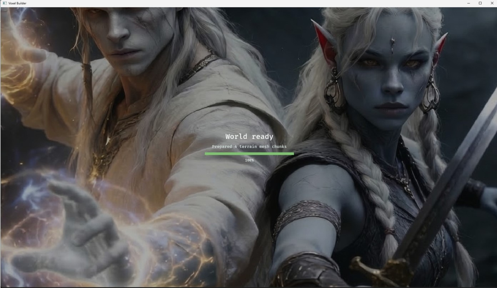
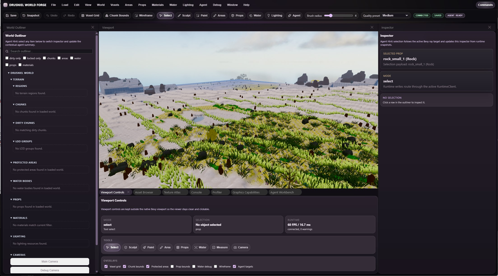
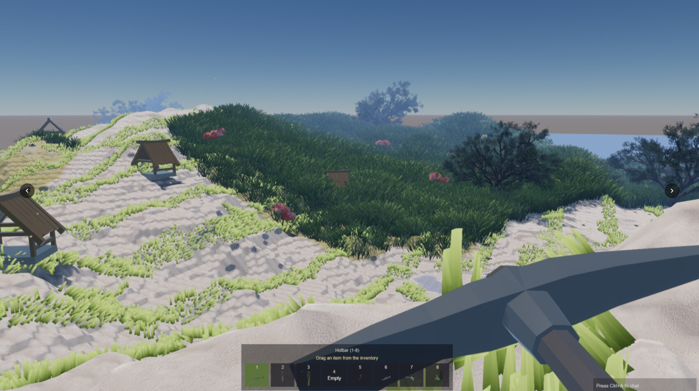

# Drusniel Voxels

Game based on https://www.drusniel.com/ lore.

Play with the online web version:  [https://danielsobrado.github.io/drusniel-voxels-bevy/](https://danielsobrado.github.io/drusniel-voxels-web/)

## Version History

See [version-history.md](docs/reference/version-history.md) for release notes and historical feature summaries.

| Version | Summary | Main Image |
| ------- | ------- | ---------- |
| [v0.5](docs/reference/version-v0-5.md) | Current development version with water overhaul, NAADF experiments, performance work, collider benches, sounds, fantasy ui, web based clod poc, terrain hex-tiling (breaks up repeated texture patterns on large surfaces), and the new editor. |  |
| [v0.4](docs/reference/version-v0-4.md) | Rendering stack, GI, atmosphere, terrain tools, building systems, props, and persistence. |  |
| [v0.3](docs/reference/version-v0-3.md) | PBR materials, triplanar splatting, surface-net fixes, and smoother slope movement. |  |
| [v0.2](docs/reference/version-v0-2.md) | Procedural grass, terrain balance, water restoration, texture assets, and rendering polish. |  |
| [v0.1](docs/reference/version-v0-1.md) | Initial implementation, chunk rendering fixes, and tilable terrain adjustments. |  |

## Controls

See [controls.md](docs/reference/controls.md) for the full keyboard and mode reference.

## Profiling

See [profiling.md](docs/reference/profiling.md) for profiling, benchmarking, and regression guard commands.

## Rendering And NAADF

See [naadf.md](docs/rendering/naadf.md) for the experimental NAADF rendering backend overview, current status, Path-B compositor notes, and test/bench commands.

## Free Texture Sources Guide

See [free-texture-sources.md](docs/reference/free-texture-sources.md) for texture source links, folder layout, naming, and stylization notes.

## Editor

See [editor.md](docs/reference/editor.md) for desktop editor startup, build, and frontend development commands.
