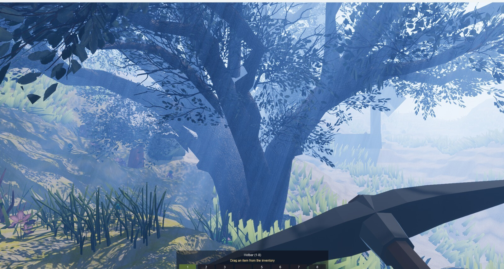
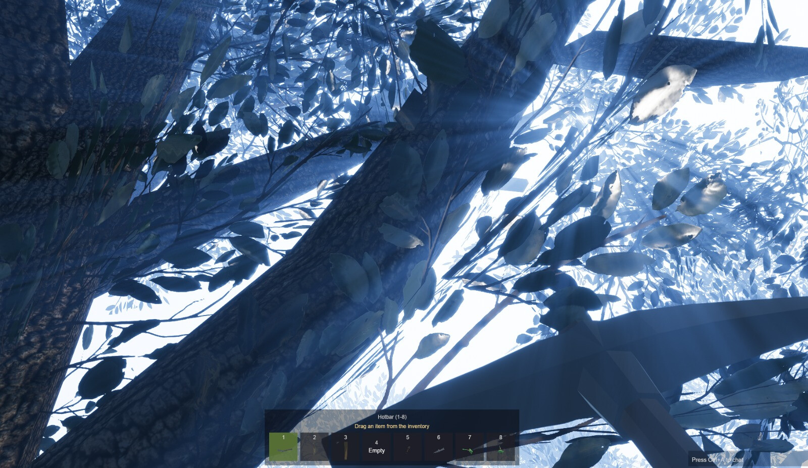
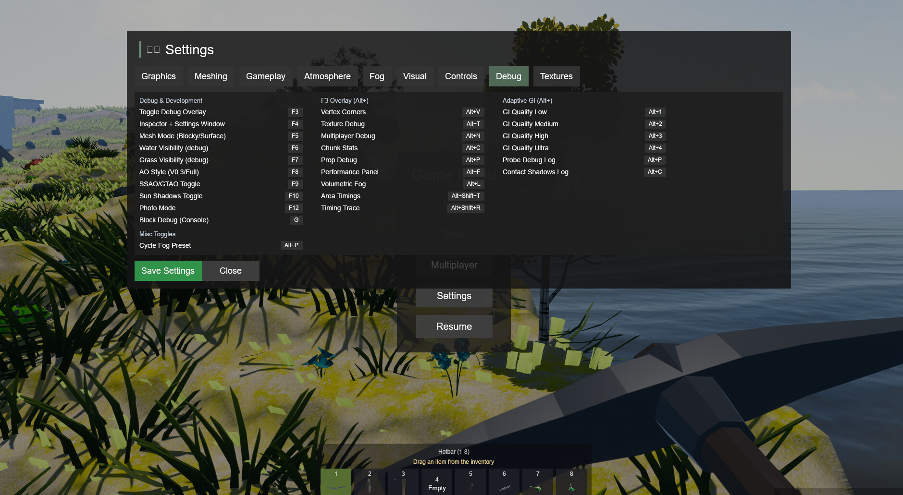
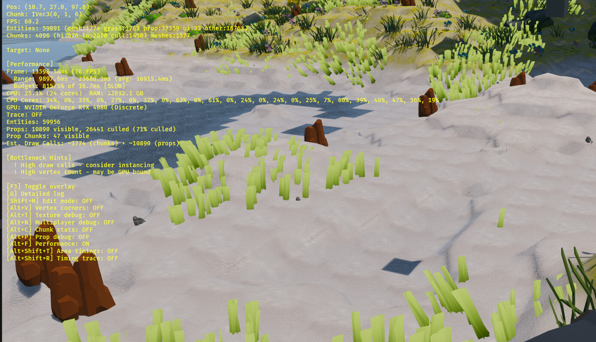
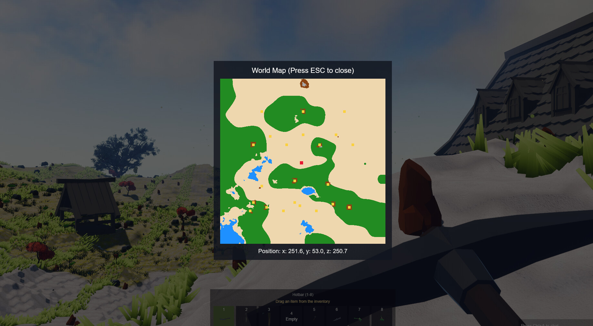
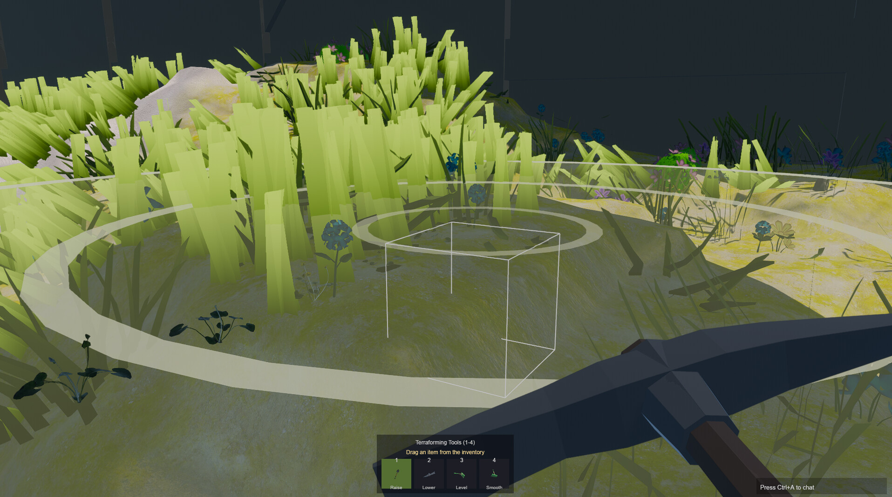
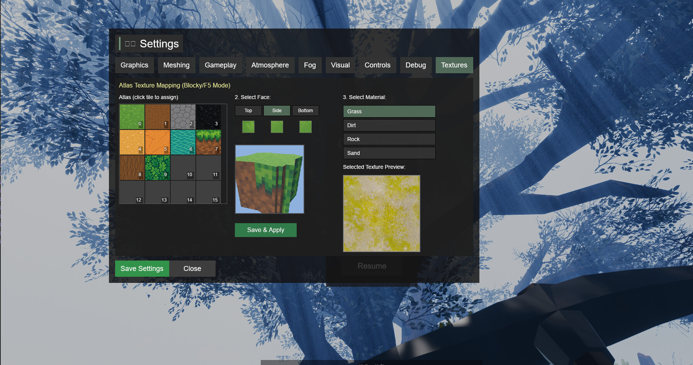

# v0.4

* **Bevy 0.18 Rendering Stack**: HDR pipeline with tonemapping, bloom, debanding, and color grading on the main camera.
* **Radiance Cascades GI**: Screen-space global illumination using voxel SDF data for efficient ray marching, providing realistic indirect lighting with multi-cascade probe system and temporal reprojection.
* **Adaptive GI Enhancements**: Stochastic one-from-eight probe selection (~8x GI performance gain at Low quality), SDF-based terrain shadows leveraging voxel data, and screen-screen contact shadows for vegetation micro-detail. Quality presets (Low/Medium/High/Ultra) with ~15% performance range. Toggle with Alt+1/2/3/4, debug with Alt+P.
* **Aerial Perspective**: Custom shaders (buildings, props, grass) now blend toward fog color at distance, matching terrain fog behavior for consistent atmospheric depth.
* **Environment Map Lighting**: Skybox-based IBL (Image-Based Lighting) for improved PBR reflections and ambient lighting that tracks time-of-day.
* **Ambient + Atmospheric Effects**: GTAO (Ground Truth Ambient Occlusion via XeGTAO port), PCSS soft shadows, distance + volumetric fog with atmospheric falloff, and time-of-day color blending.
* **Volumetric Clouds**: Raymarched volumetric clouds with temporal reprojection, Henyey-Greenstein scattering, and configurable cloud types (stratus/stratocumulus/cumulus).
* **Enhanced Water** *(superseded by v0.5 water overhaul)*: Initial Gerstner wave simulation with foam generation and caustic effects.
* **Weather Particles**: GPU-accelerated weather system (rain/snow/dust) via bevy_hanabi with camera-following emitters.
* **Vegetation Wind**: Multi-layer wind animation for vegetation (trunk sway, branch movement, leaf flutter) with configurable presets. Enhanced grass shader with SSS (subsurface scattering) and contact shadows for realistic foliage rendering.
* **Wind + Foliage Notes**: Detailed write-up on segmented tree bending, UV-based leaf flutter, and depth pre-pass optimization for alpha-cutout foliage in [docs/wind-foliage-depth-prepass.md](docs/wind-foliage-depth-prepass.md).
* **Vegetation Alpha Fade**: Grass-like props fade to a configurable minimum alpha near the camera to keep visibility through dense foliage. Tuned in the Shift+F4 settings.
* **Shadow + LOD Alignment**: Cascade shadows tuned to fog visibility and chunk LOD cull distances to avoid dark banding.
* **Texture Quality**: Texture arrays with mipmaps and anisotropic filtering for terrain, plus expanded PBR materials for buildings/props.
* **Chunk LOD System**: High/low/culled LODs with skirts for seam hiding and integrated GPU fallbacks.
* **Prop LOD System**: Multi-level LOD for props with billboard and mesh decimation support:
  * **Billboard LOD**: Distant trees rendered as axial (Y-axis rotation) billboards for ~95% vertex reduction. Distance-based switching with hysteresis to prevent flickering.
  * **Mesh Decimation**: Vertex clustering algorithm creates LOD1 (50%) and LOD2 (75%) decimated mesh variants at load time for mid-distance props.
  * **Extended View Distance**: Props now visible up to 350-420 units (trees furthest) to reduce pop-in.
* **Snap Point Building System**: Enshrouded-style modular construction with automatic piece alignment:
  * **Snap Point Detection**: Spatial hash index for O(1) queries finds compatible connection points within 0.75m radius.
  * **Snap Groups**: Compatibility rules (FloorEdge↔WallBottom, WallSide↔WallSide, etc.) ensure pieces connect logically.
  * **Ghost Preview**: Color-coded placement preview (green=valid, red=invalid, blue=snapped) with gizmo visualization.
  * **Piece Registry**: Extensible registry with predefined pieces (floors, walls, fences, pillars) and configurable snap points.
  * **Snap Toggle**: Press X to toggle snap mode on/off for free placement when needed.
* **Meshing Settings**: Greedy meshing toggle in Settings > Meshing (runtime flag; algorithm integration pending).
* **Config-Driven Tuning**: YAML configs for fog, AO, terrain generation, props, camera exposure, clouds, water, wind, weather, and GI.
* **World + Tools**: Save/load persistence, minimap, and debug overlays.
* **Enhanced Terrain Tools**: Gradual sculpting (Raise/Lower/Level/Smooth) with brush size/strength controls and visual preview cursor. Toggled via T key with dedicated hotbar UI.
* **UI + Modes**: Settings menu (graphics/meshing/gameplay/atmosphere/fog/visual), map overlay, inventory/hotbar, chat overlay, and photo mode (DoF/motion blur).
* **Prop Persistence System**: Calculate-once, persist-forever prop placement with multi-sample terrain analysis, slope-based rotation, and chunk-based JSON storage. Props are precisely placed using 5-point sampling for accurate ground contact, then saved to `saves/props/` for instant loading on subsequent runs. Supports dirty chunk regeneration when terrain is modified.

Examples of volumetric fog in this version (toggle with Alt+L; parameters are tunable in the Settings > Fog menu):

Debug overlay examples (toggle with F3; sub-toggles are listed in the Debug tab):

Minimap example (toggle with M):

Terraforming tools in action (toggle with T):

* **Terrain Conform**: Props like buildings now automatically flatten the terrain beneath them for seamless integration.
* **Sculpting**: Improved brush controls for raising, lowering, leveling, and smoothing terrain.

New Atlas Texture Mapping UI (Settings > Textures):

* **Live Editing**: Reassign block face mappings (Top/Side/Bottom) in real-time.
* **3D Preview**: Visualize changes instantly on a rotating 3D block preview.
* **Visual Picker**: Select atlas tiles directly from a visual grid instead of guessing indices.

Props and vegetation with LOD optimizations:

#### Known Issues (v0.4)

* **Volumetric Fog Performance**: Volumetric fog can cause significant frame drops, especially on mid-tier GPUs.
* **God Rays With fog**: ~~Fixed in v0.5~~ — screen-space god rays now work independently of volumetric fog.
* **Mesh gaps**: Small gaps happening sometimes.
* **Culling on close distance**: When digging and there are close distance polygons, culling and visibility has issues.
* **Shallow water**: Shore foam, edge coloring, and caustics improved in v0.5.
* **LODS**: Small gaps and errors can be seen far away in the LODs.

