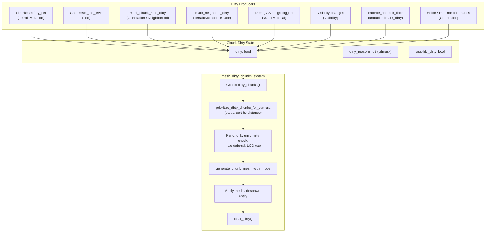

# Dirty Mesh Subsystem — Code Review

Document status (2026-05-17): historical implementation/debug note; preserve for context, but verify current behavior in code.

> [!NOTE]
> Reviewed 2026-05-13 against `src/voxel/chunk.rs`, `src/voxel/plugin.rs`,
> `src/voxel/world.rs`, `src/interaction/editing.rs`, `src/runtime_commands.rs`,
> and all call-sites of `mark_dirty` / `mark_dirty_with_reason`.

---

## 1  Architecture Overview

The dirty-mesh pipeline determines **which chunks need a mesh rebuild** on each
frame and processes them in priority order. It comprises four cooperating
layers:



### 1.1  Dirty Reasons (bitmask)

Defined in [chunk.rs](file:///Users/jdanielsobrado/workspace/others/drusniel-voxels-bevy/src/voxel/chunk.rs#L208-L228):

| Bit | Reason | Producers |
|-----|--------|-----------|
| 0 | `Lod` | `Chunk::set_lod_level` |
| 1 | `NeighborLod` | `mark_chunk_lod_halo_dirty` |
| 2 | `Visibility` | (defined but **never set** — see Issue #1) |
| 3 | `Generation` | `Chunk::new`, `Chunk::from_data`, `generate_chunk_async`, `mark_surface_nets_halo_dirty`, editor/runtime commands |
| 4 | `WaterMaterial` | `toggle_mesh_mode`, water material settings changes |
| 5 | `TerrainMutation` | `Chunk::set`, `Chunk::try_set`, `mark_neighbors_dirty`, `VoxelWorld::apply_voxel_edit` |

### 1.2  Dirty State Lifecycle

```
Chunk created/loaded → dirty=true, reasons=Generation
     ↓
mesh_dirty_chunks_system picks it up
     ↓
generate_chunk_mesh_with_mode (immutable read)
     ↓
clear_dirty()  →  dirty=false, reasons=0
```

If new dirty reasons arrive between the collect and the clear, they are lost.
See Issue #3.

### 1.3  Throttling Constants

| Constant | Value | Purpose |
|----------|-------|---------|
| `MAX_CHUNKS_PER_FRAME` | 4 | Max meshes generated per frame (normal) |
| `MAX_LOD_DIRTY_CHUNKS_PER_FRAME` | 1 | Max meshes generated per frame when only LOD/visibility/water-material churn |
| `MAX_DIRTY_CHUNKS_VISITED_PER_FRAME` | 64 | Max dirty chunks examined per frame |
| `MAX_DIRTY_CHUNKS_VISITED_WITH_DEFERRED_PER_FRAME` | 512 | Elevated visit cap when Surface Nets halo deferral is active |

---

## 2  Detailed Walk-through of `mesh_dirty_chunks_system`

Source: [plugin.rs:1600–2267](file:///Users/jdanielsobrado/workspace/others/drusniel-voxels-bevy/src/voxel/plugin.rs#L1600-L2267)

### Phase 1 — Collection & Sorting

1. All chunks where `chunk.is_dirty()` are collected into `dirty_chunks: Vec<IVec3>` via `world.dirty_chunks()` — an **O(N)** linear scan of the `HashMap<IVec3, Chunk>`.
2. `MeshDirtyReasonCounts` accumulates per-reason tallies for timing telemetry.
3. `prioritize_dirty_chunks_for_camera` performs a **partial sort**:
   - If `dirty_chunks.len() > visit_limit`, uses `select_nth_unstable_by` to partition the closest `visit_limit` chunks, then sorts only that window.
   - Otherwise full sort.
   - Comparison uses `distance_squared` from camera to chunk center.

### Phase 2 — Per-Chunk Decision Loop

For each dirty chunk (up to visit/frame limits):

| Decision | Result |
|----------|--------|
| Culled LOD | Despawn entity + `clear_dirty()`, skip |
| Empty uniformity, no SN boundary surface | Despawn entity + `clear_dirty()`, skip |
| Empty but SN boundary surface | Force Lod0 sampling, mesh normally |
| Missing in-bounds neighbors (Surface Nets) | Defer (skip without clearing dirty) |
| Normal | Generate mesh, apply, `clear_dirty()` |

### Phase 3 — Entity Management

- **Existing entity**: updates `Mesh3d`, material, `ChunkMesh` component, inserts `NeedsCollider`.
- **New entity**: spawns with position, mesh, material, render layers, `NeedsCollider`.
- Water mesh and water-mask entities follow the same spawn-or-update pattern.

### Phase 4 — Statistics & Telemetry

- Runtime chunk stats recomputed every 30 frames, **deferred** when the dirty queue is backed up beyond the frame limit.
- ~30 timing/counter rows recorded for bench analysis.

---

## 3  Dirty Propagation Paths

### 3.1  Voxel Edit (runtime)

`VoxelWorld::apply_voxel_edit` → `Chunk::set` auto-marks `TerrainMutation`.
Then the caller (`editing::apply_edit_and_mark`) calls `mark_neighbors_dirty`
which marks the **6 face-adjacent** chunk neighbors (within 1 voxel of boundary).

**`VoxelWorld::apply_voxel_edit` internally** also marks the full 26-neighbor
halo when the local coordinate is within 1 of a boundary (lines 366–389).

### 3.2  Chunk Generation (async)

`generate_chunk_async` → `chunk.clear_dirty()` + `chunk.mark_dirty_with_reason(Generation)`.
After insertion: `mark_surface_nets_halo_dirty` → 26-neighbor halo with `Generation`.

### 3.3  LOD Change

`update_chunk_lod_system` → `chunk.set_lod_level(target)` auto-marks `Lod`.
After the change: `mark_chunk_lod_halo_dirty` → 26-neighbor halo with `NeighborLod`.

### 3.4  Settings / Debug Toggles

`toggle_mesh_mode`, water material settings → iterate all chunks,
`chunk.mark_dirty_with_reason(WaterMaterial)`.

### 3.5  Editor / Runtime Commands

`runtime_commands::mark_chunk_dirty` → `mark_dirty_with_reason(Generation)`.
Editor bridge → `mark_dirty_with_reason(Generation)`.

---

## 4  Identified Issues

### Issue #1 — `MeshDirtyReason::Visibility` Is Never Set  
**Severity: Low (dead code / misleading telemetry)**

`Visibility` has bit 2 reserved and the system counts it in `MeshDirtyReasonCounts`,
but **no code path ever calls** `mark_dirty_with_reason(MeshDirtyReason::Visibility)`.
The `visibility_dirty` boolean on `Chunk` is a separate flag consumed by
`update_chunk_face_visibility_system` and never sets the mesh-dirty reason.

This means the "Mesh Dirty Reason Visibility" timing counter will always be 0,
and if a future change adds visibility-based re-meshing, the reason tracking
won't fire unless someone remembers to wire it up.

**Remediation:** Either remove the `Visibility` variant and its counter, or wire
`mark_visibility_dirty()` to also set the mesh dirty reason so the telemetry
becomes meaningful. The choice depends on whether visibility changes should
trigger re-meshing (they currently don't).

---

### Issue #2 — `enforce_bedrock_floor` Uses Untracked `mark_dirty()`  
**Severity: Low (diagnostic gap)**

[plugin.rs:816](file:///Users/jdanielsobrado/workspace/others/drusniel-voxels-bevy/src/voxel/plugin.rs#L816)
calls `chunk.mark_dirty()` without a reason. This means:
- `dirty_reason_flags()` returns 0 for these chunks.
- The telemetry reason breakdown will under-count.
- `lod_churn_only` will evaluate to `false` (no reason bits set = none match),
  so the frame limit falls through to `MAX_CHUNKS_PER_FRAME` — the correct
  behavior, but accidentally.

**Remediation:** Replace with
`chunk.mark_dirty_with_reason(MeshDirtyReason::Generation)`.

---

### Issue #3 — Race Between Dirty Collection and `clear_dirty()`  
**Severity: Medium (lost dirty flags)**

The system collects all dirty chunk positions at the start of the frame
(line 1640), then iterates them and calls `clear_dirty()` after meshing each
one. If a **concurrent producer** (e.g. a Bevy system running in the same
frame, or the editor bridge) marks a chunk dirty between collection and clear,
that dirty flag is silently erased.

Currently this is mitigated by the system ordering: `mesh_dirty_chunks_system`
runs after LOD and visibility updates. Editing and runtime commands run on the
main thread through `ResMut<VoxelWorld>`, which the system also holds via
`ResMut`, so Bevy's exclusive access prevents true concurrency within a single
frame's `Update` stage.

However, the design is fragile:
- If a new system is added that runs after `mesh_dirty_chunks_system` and marks
  chunks dirty, those flags survive to the next frame (correct).
- But if it runs *before* and the chunk was already in the dirty queue, the
  clear at line 1859 will erase the new flag.

**Remediation:** Consider a **generation counter** approach:
1. `Chunk` stores a `dirty_generation: u64` that increments on each `mark_dirty*`.
2. `mesh_dirty_chunks_system` snapshots the generation at collection time.
3. `clear_dirty()` only clears if the generation hasn't changed since the snapshot.

Alternatively, since the current system ordering makes this safe today,
document the ordering invariant as a comment in the system registration block.

---

### Issue #4 — Double Dirty Propagation on Boundary Edits  
**Severity: Low (redundant work, no correctness bug)**

When a voxel is edited near a chunk boundary, dirty marking happens **twice**:

1. `VoxelWorld::apply_voxel_edit` (lines 366–389) marks the full 26-neighbor
   halo for any voxel within 1 of a boundary.
2. `editing::mark_neighbors_dirty` (lines 432–461) marks the 6 face-adjacent
   neighbors for the same condition.

The 6-face marking is a **strict subset** of the 26-neighbor halo, so all work
in step 2 is redundant when step 1 already ran. The `mark_dirty_with_reason`
call is idempotent (OR into bitmask), so there's no correctness issue — just
wasted HashMap lookups.

**Remediation:** Either:
- Remove `mark_neighbors_dirty` from `apply_edit_and_mark` since
  `VoxelWorld::apply_voxel_edit` already handles neighbor dirtying, **or**
- Remove the halo logic from `apply_voxel_edit` and let callers be responsible.

The first option is simpler: `apply_voxel_edit` is the single source of truth
for edit-triggered dirty propagation, and callers shouldn't need to know about it.

---

### Issue #5 — `editing::mark_neighbors_dirty` Uses Hardcoded `14` Instead of `CHUNK_SIZE - 2`  
**Severity: Low (fragile constant)**

[editing.rs:445–450](file:///Users/jdanielsobrado/workspace/others/drusniel-voxels-bevy/src/interaction/editing.rs#L445-L450)
uses the literal `14` for boundary checks (`local.x >= 14`, etc.), which
assumes `CHUNK_SIZE == 16`. If `CHUNK_SIZE` ever changes, this will silently
break.

Compare with `VoxelWorld::apply_voxel_edit` which correctly uses
`(CHUNK_SIZE_I32 - 2) as u32`.

**Remediation:** Replace `14` with `(CHUNK_SIZE_I32 - 2) as u32` or
`CHUNK_SIZE as u32 - 2`.

---

### Issue #6 — `lod_churn_only` Logic Gap When Dirty Reasons Are Zero  
**Severity: Low (edge case)**

When `enforce_bedrock_floor` marks chunks dirty without a reason (Issue #2),
`dirty_reason_flags()` is 0. The `lod_churn_only` check at line 1667:

```rust
let lod_churn_only = reason_counts.generation == 0
    && reason_counts.terrain_mutation == 0
    && (reason_counts.lod > 0
        || reason_counts.neighbor_lod > 0
        || reason_counts.visibility > 0
        || reason_counts.water_material > 0);
```

When **all** reason counts are 0 (because `mark_dirty()` set no bits), the
`(lod > 0 || ...)` clause is false, so `lod_churn_only` = false. This means
the frame limit correctly falls to `MAX_CHUNKS_PER_FRAME` (4), not the
throttled `MAX_LOD_DIRTY_CHUNKS_PER_FRAME` (1).

But this is an accident — the code doesn't explicitly handle "dirty with no
reason". Fixing Issue #2 eliminates this edge case.

---

### Issue #7 — O(N) `dirty_chunks()` Scan on Every Frame  
**Severity: Medium (performance on large worlds)**

`VoxelWorld::dirty_chunks()` iterates **all chunks** in the HashMap to find
dirty ones ([world.rs:418–423](file:///Users/jdanielsobrado/workspace/others/drusniel-voxels-bevy/src/voxel/world.rs#L418-L423)).
For a 32×6×32 world that's 6,144 chunks scanned every frame, even when zero
are dirty.

This is separate from the O(N) `recompute_from_world` (which is already
gated by `should_recompute_runtime_chunk_stats`).

**Remediation:** Maintain a `dirty_set: HashSet<IVec3>` alongside the main
HashMap. When `mark_dirty*` is called, insert into the set. When `clear_dirty`
is called, remove. `dirty_chunks()` returns an iterator over the set.

This is the same pattern already used by `SdfVolumeState::dirty_chunk_set`
in `radiance_cascades.rs`, which proves the approach works in this codebase.

---

### Issue #8 — Surface Nets Halo Deferral Can Starve LOD-Only Chunks  
**Severity: Low (visual delay, not a bug)**

When `surface_nets_chunks_deferred_for_halo > 0`, the visit limit jumps from
64 to 512. The system processes all 512 positions, but only meshes up to
`chunks_per_frame_limit`. If the deferred queue is large, the elevated visit
limit means LOD-only chunks at the end of the sorted list are visited but can't
mesh (frame limit hit), burning CPU on uniformity checks and halo lookups.

In LOD-churn-only mode, `chunks_per_frame_limit` drops to 1, so 511 of those
visits are wasted if all 512 happen to be LOD-only.

**Remediation:** Check if the elevated visit limit is necessary when
`lod_churn_only` is true. If yes, the visit limit should stay at 64 for
LOD-churn-only frames regardless of halo deferral state.

---

### Issue #9 — No Deduplication Guard in `mark_neighbors_dirty` (editing.rs)  
**Severity: Negligible (correctness-safe, minor redundancy)**

`mark_neighbors_dirty` checks 6 face directions independently, so a voxel at a
corner (e.g., `local = (0, 0, 0)`) marks 3 axis-aligned neighbors. But
`VoxelWorld::apply_voxel_edit` already marked a full 26-neighbor halo for that
same edit. As noted in Issue #4, this is redundant. Within
`mark_neighbors_dirty` itself there is no issue since the 6 directions never
overlap.

---

### Issue #10 — `clear_dirty` + `mark_dirty_with_reason` Sequence in `generate_chunk_async`  
**Severity: Negligible (works but confusing)**

[plugin.rs:1432–1433](file:///Users/jdanielsobrado/workspace/others/drusniel-voxels-bevy/src/voxel/plugin.rs#L1432-L1433):

```rust
chunk.clear_dirty();
chunk.mark_dirty_with_reason(MeshDirtyReason::Generation);
```

This clears any dirty reasons accumulated during `chunk.set()` calls in the
generation loop (which auto-mark `TerrainMutation`), then re-marks with
`Generation`. The intent is to collapse all per-voxel mutation marks into a
single clean generation reason.

This works correctly, but the two-step sequence is non-obvious. A dedicated
`reset_dirty_to_reason(reason)` method would be clearer.

---

## 5  Test Coverage Assessment

| Behavior | Tested | Source |
|----------|--------|--------|
| 26-neighbor halo for generation | ✅ | `generated_chunk_marks_full_3d_halo_dirty` |
| 26-neighbor halo for LOD | ✅ | `lod_change_marks_full_3d_halo_dirty` |
| NeighborLod reason tagging | ✅ | Assertion in `lod_change_marks_full_3d_halo_dirty` |
| Surface Nets deferral predicate | ✅ | `surface_nets_mesh_defers_when_in_bounds_halo_is_missing` |
| Empty chunk SN Lod0 cap | ✅ | `empty_surface_nets_cap_forces_lod0_sampling` |
| Priority sort (partial) | ✅ | `dirty_chunk_priority_sorts_only_nearest_visit_window` |
| Stats recompute gating | ✅ | `runtime_chunk_stats_recompute_continues_after_dirty_queue_drains` |
| Boundary edit marks neighbor dirty | ✅ | `voxel_edit_legal_boundary_edit_marks_neighbor_chunk_dirty` |
| `mark_dirty()` without reason | ❌ | No test for `enforce_bedrock_floor` path |
| Visibility reason never set | ❌ | No test verifying no producer sets it |
| Double dirty propagation | ❌ | No test comparing `apply_voxel_edit` vs `mark_neighbors_dirty` |
| `lod_churn_only` with zero reasons | ❌ | No test for the edge case |

---

## 6  Remediation Plan

### Priority 1 — Low-effort correctness/clarity fixes

| # | Issue | Action | Files | Effort |
|---|-------|--------|-------|--------|
| P1.1 | #2 | Replace `chunk.mark_dirty()` with `chunk.mark_dirty_with_reason(MeshDirtyReason::Generation)` in `enforce_bedrock_floor` | [plugin.rs:816](file:///Users/jdanielsobrado/workspace/others/drusniel-voxels-bevy/src/voxel/plugin.rs#L816) | 1 line |
| P1.2 | #5 | Replace hardcoded `14` with `(CHUNK_SIZE_I32 - 2) as u32` | [editing.rs:445–450](file:///Users/jdanielsobrado/workspace/others/drusniel-voxels-bevy/src/interaction/editing.rs#L445-L450) | 3 lines |
| P1.3 | #10 | Add `Chunk::reset_dirty_to_reason(reason)` helper, use in `generate_chunk_async` | chunk.rs, plugin.rs | ~10 lines |
| P1.4 | #1 | Remove `MeshDirtyReason::Visibility` variant and its counter, or document it as reserved | chunk.rs, plugin.rs, hole_probe.rs | ~20 lines |

### Priority 2 — Moderate-effort performance improvement

| # | Issue | Action | Files | Effort |
|---|-------|--------|-------|--------|
| P2.1 | #7 | Add `dirty_set: HashSet<IVec3>` to `VoxelWorld`, maintain on mark/clear, replace `dirty_chunks()` | world.rs, chunk.rs | ~40 lines |
| P2.2 | #4 | Remove `mark_neighbors_dirty` call from `apply_edit_and_mark` since `apply_voxel_edit` already handles it | editing.rs | ~5 lines (but needs audit of all `mark_neighbors_dirty` callers) |

### Priority 3 — Design hardening (optional)

| # | Issue | Action | Files | Effort |
|---|-------|--------|-------|--------|
| P3.1 | #3 | Document the system ordering invariant as a comment, or implement generation-counter `clear_dirty` | plugin.rs, chunk.rs | Comment: 5 lines; Counter: ~30 lines |
| P3.2 | #8 | Skip elevated visit limit when `lod_churn_only` is true | plugin.rs | ~3 lines |
| P3.3 | — | Remove `mark_dirty()` (no-reason variant) from public API, forcing all callers to specify a reason | chunk.rs | ~5 lines (compile will catch any missed callers) |

---

## 7  Subsystem Interaction Map

The dirty-mesh subsystem touches or is touched by these other subsystems:

| Subsystem | Interaction |
|-----------|-------------|
| **LOD** (`update_chunk_lod_system`) | Sets `Lod` reason on the chunk, triggers `NeighborLod` on 26-halo; ordered *before* `mesh_dirty_chunks_system` |
| **Terrain Collider** (`terrain_collider.rs`) | Consumes `NeedsCollider` component spawned by mesh system; has its own `TerrainCollisionDirtyCause` (separate dirty domain) |
| **Occlusion / Face Visibility** | `visibility_dirty` flag is a parallel dirty domain consumed by `update_chunk_face_visibility_system`; does **not** trigger mesh rebuild |
| **SDF / Radiance Cascades** | Has its own `dirty_chunks` / `dirty_chunk_set` (separate dirty domain, same pattern) |
| **Props** | `mark_neighbors_dirty` called from `spawner.rs` when props modify terrain |
| **Bench Readiness** | `dirty_chunks` count is part of the bench readiness signature; startup overlay waits for dirty queue to drain |
| **Editor Bridge** | Reads `is_dirty()` and `dirty_reason_flags()` for chunk inspector; can mark chunks dirty via `Generation` |

---

## 8  Key Invariants

These invariants must hold for the system to be correct:

1. **Every `mark_dirty*` must set `dirty = true`.** The `mark_dirty()` variant does this but sets no reason bits — this should be deprecated (P3.3).

2. **`clear_dirty()` must zero both `dirty` and `dirty_reasons`.** Currently correct.

3. **All systems that produce dirty state must run before `mesh_dirty_chunks_system` in the `Update` schedule.** Currently enforced by `.after()` chains in plugin registration.

4. **Surface Nets chunks must not be meshed until all in-bounds boundary neighbors exist.** Enforced by `should_defer_surface_nets_mesh`.

5. **`dirty_chunks()` must not miss any dirty chunk.** Currently relies on full HashMap scan — correct but O(N). A `dirty_set` (P2.1) must maintain the same guarantee.

6. **Despawning a culled/empty chunk's entity must also clear the chunk's entity handle.** Currently correct — `clear_mesh_entity()` / `clear_water_mesh_entity()` / `clear_water_mask_mesh_entity()` always paired with `commands.entity(entity).despawn()`.
