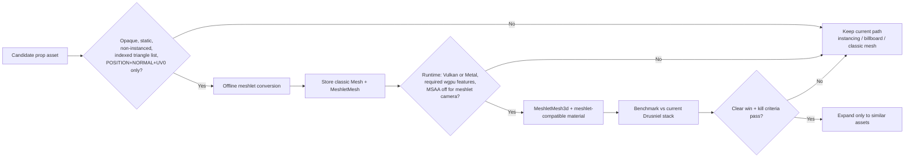

# Opaque Static Prop Meshlet Pilot — Execution Plan

> **Former title:** Props Virtual Geometry. Reframed 2026-06-10: this is a **narrow Bevy meshlet pilot**, not a project-wide props migration.  
> Created: 2026-06-10 · Status: Planning (external review incorporated 2026-06-10)  
> Scope: `src/props/`, `src/rendering/materials/props.rs`, `assets/shaders/props.wgsl`,  
> `assets/shaders/instanced_prop.wgsl`, `assets/config/`, `bench/scenes/forest/`,  
> `bench/scenes/visual/visual-regression-performance100.toml`  
> Owner: rendering / props  
> Related: [`docs/legacy/lod-implementation-and-review.md`](../legacy/lod-implementation-and-review.md),  
> [`docs/plans/clod-execution-plan.md`](clod-execution-plan.md) §9 (terrain meshlets deferred separately)

## Summary

Drusniel props today use a **custom GPU instancing path** (`PropInstancingPlugin`) with
distance LOD (shadow cull, billboard swap, view-distance hide) and staged mesh decimation that
is not yet wired to runtime swaps. There is **no** `MeshletMesh3d` or Bevy virtual geometry in
the project.

This plan adds **Bevy experimental meshlet rendering** (cluster LOD / visibility-buffer path —
*not* a custom Nanite implementation) for a **small opaque static subset** of props, while
**leaving instancing, billboards, and alpha vegetation paths untouched**.

**Primary win target:** hero rocks, ruins, cliffs, village buildings, and other **static opaque
high-triangle** assets where triangle count and overdraw dominate — **not** mass forest foliage
where count, alpha, wind, and instancing already win.

**Explicit non-goal:** replace terrain rendering. CLOD terrain pages keep their own meshlet
decision in [`clod-execution-plan.md`](clod-execution-plan.md).

**Review verdict (2026-06-10):** **Approve only as a tightly-scoped meshlet pilot** on Vulkan +
Metal with automatic fallback to today's prop stack. **Reject as a global prop strategy** without
the scope limits below. Cheaper near-term win: wire `decimation.rs` runtime LOD (§11) **before or
in parallel** with meshlet work for mid-distance props.

```text
Virtual geometry helps when the bottleneck is too many visible triangles.
Instancing / billboards / culling help when the bottleneck is too many repeated objects.
```

### Hybrid prop lanes (do not collapse into one path)

| Lane | Asset examples | Path |
|------|----------------|------|
| **Mass foliage** | Grass, flowers, bushes, normal trees | Instancing, patch/subcluster culling, wind shader, billboards/impostors — **not meshlets in v1** |
| **Static dense-asset** | Large rocks, cliffs, ruins, towers, village walls | **Meshlet pilot candidates** (opaque, static, indexed `{POSITION, NORMAL, UV_0}`) |
| **Small repeated props** | Barrels, crates, fences, lamps | Instancing, batching, classic/decimation LOD — **not meshlets first** |

Special-case: **hero trees** (trunk/opaque only) may enter the pilot individually; **forest tree
fields stay instanced + billboard**.

---

## Current state (baseline)

Cross-referenced against the codebase 2026-06-10. All claims verified unless noted.

| Area | Today | File(s) |
|------|-------|---------|
| Draw path | Custom binned instancing (`Opaque3d` / `AlphaMask3d` / `Transparent3d` + `Shadow`) | `src/props/instanced_render.rs` |
| Mesh asset | Plain `Mesh` cached from GLTF | `src/props/instancing.rs` (`PropMeshCache`) |
| Material | Custom `PropsMaterial`, forward-only | `src/rendering/materials/props.rs` |
| Instancing shader | `instanced_prop.wgsl`: 4×4 model matrix `@location(4–7)`, optional tint `@location(8)` via `#ifdef PROP_INSTANCE_TINT`; **UV-based sampling** | `assets/shaders/instanced_prop.wgsl` |
| Non-instanced material shader | `props.wgsl`: **triplanar** + **vertex-colour-weighted** sampling (not instanced draw path) | `assets/shaders/props.wgsl` |
| Meshlet mesh input | Bevy `MeshletMesh::from_mesh` expects **indexed triangle list** + **`{POSITION, NORMAL, UV_0}` only** | upstream Bevy 0.18 docs — current prop/instanced paths are richer |
| Shadow LOD | `PROP_SHADOW_CULL_DISTANCE = 64 m`, hysteresis `8 m`, scaled by `RenderQualityPreset::prop_shadow_distance_scale()`; group-level shadow LOD also in `instanced_render.rs` | `src/props/lod_material.rs`, `instanced_render.rs` |
| Billboard LOD | `BILLBOARD_SWITCH_DISTANCE = 180 m` (trees) | `src/props/billboard.rs` |
| View-distance cull | Base `PROP_VIEW_DISTANCE_BASE = 280 m` with per-type multipliers: Trees `1.2×`, Rocks `0.85×`, Bushes `0.6×`, Flowers `0.25×` | `src/props/constants.rs`, `mod.rs` |
| Mesh LOD (unused) | `MeshLod` component defined; no consuming system wired | `src/props/decimation.rs` |
| Bevy meshlets | Not enabled in `Cargo.toml`; zero `src/` references | — |
| Water shader | `#ifdef MESHLET_MESH_MATERIAL_PASS` + `resolve_vertex_output` hooks only | `assets/shaders/water_fragment.wgsl` |
| Quality presets | `Low`, `Medium`, `High` (default), `Performance100` — no `Ultra` variant | `src/rendering/device/quality.rs` |
| Config loading | `assets/config/` + serde + `ResMut<T>` (same pattern as `mc_transvoxel.yaml`) | `assets/config/` |
| Reflection layers | `REFLECTION_RENDER_LAYER` at instanced **group** granularity | [`docs/implementation/prop-reflection-layers.md`](../implementation/prop-reflection-layers.md) |

Bench toggles already exist for prop A/B: `disable_instanced_props`, `disable_prop_lod_hiding`,
`disable_prop_shadow_lod`, `prop_subcluster_grid`, `quality_preset` — reuse these during rollout.

### Shader path nuance (Phase 2 target)

The instanced renderer — what players actually see for props today — uses **UV-based** sampling in
`instanced_prop.wgsl`. `PropsMaterial` + `props.wgsl` implements **triplanar** sampling but that
path is not what `PropInstancingPlugin` draws.

**Phase 2 decision:** `props_meshlet.wgsl` must match **UV-based instanced output** (visual parity
with `instanced_prop.wgsl`), not triplanar `props.wgsl`. Triplanar port remains optional if a prop
type is ever rendered outside the instancing path.

---

## Goals

```text
G1. Screen-error-driven cluster LOD for high-poly prop source meshes (per prop type, not per instance).
G2. Offline bake: GLTF → MeshletMesh asset, loaded like other prop cache data.
G3. Coexist with existing instancing for low-poly / massive-count props until profiling says otherwise.
G4. Preserve visual parity on forest + performance100 bench scenes within documented thresholds.
G5. Quality-preset-controlled activation (off by default until Phase 6 gate passes).
```

## Non-goals (this plan)

```text
N1. Custom from-scratch Nanite renderer (indirect draws, software rasterizer, METIS DAG).
N2. Runtime meshlet baking on the frame path.
N3. Editor viewport parity in Phase 0–3 (game binary + bench first).
N4. Merging virtual geometry with NAADF voxel preview or terrain CLOD pages.
N5. Replacing billboard LOD for trees in v1 — billboards remain the coarsest tier.
N6. Runtime toggling of `enabled` via hot reload in v1 — startup + quality-preset only.
N7. Meshlets for **all props**, mass forest vegetation, or alpha-masked foliage in v1.
N8. Treating DX12 as a supported meshlet backend until Bevy docs drop the Vulkan/Metal-only note.
```

### Asset routing (pilot gate)



---

## 0. Invariants (do not violate in any phase)

```text
I1. PropMeshCache / PropInstanceGroups remain authoritative for prop identity and transforms.
    Virtual geometry is a render representation swap, not a gameplay or persistence change.
I2. MeshletMesh assets are derived offline from the same GLTF source meshes as today's Mesh cache.
    Do not bake from merged chunk geometry or runtime-modified meshes.
I3. Meshlet preprocessing never runs on the frame path. Bake at asset import / startup background only.
I4. Instanced-prop and meshlet-prop paths must be mutually exclusive per prop *instance*, not both
    drawing the same placement (z-fighting). One owner per rendered instance.
I5. Billboard LOD remains the final coarse tier for eligible foliage until a meshlet impostor path exists.
I6. Bench before/after claims require release benches and summary.json comparison (AGENTS.md).
I7. Do not delete decimation.rs — it is the explicit fallback (§11) if meshlets are blocked.
```

---

## Bevy meshlet API surface (pin for 0.18.1)

Grep this block when bumping Bevy; any rename/break is a migration task.

```text
Cargo features:     meshlet, meshlet_processor
Module:             bevy::pbr::experimental::meshlet
Component:          MeshletMesh3d(Handle<MeshletMesh>)
Asset:              MeshletMesh
Bake entry:         MeshletMesh::from_mesh(&mesh)   # meshlet_processor only
Material trait:     meshlet_mesh_fragment_shader()
                    meshlet_mesh_prepass_fragment_shader()
                    meshlet_mesh_deferred_fragment_shader()
Shader import:      bevy_pbr::meshlet_visibility_buffer_resolve::resolve_vertex_output
                    # behind MESHLET_MESH_MATERIAL_PASS in fragment shaders
PropsMaterial:      implements NONE of the meshlet Material methods today
```

Phase 0 must produce a **Material trait compatibility report** (required methods, shader linkage,
opaque-only rules, whether `Default`/missing hooks reject or silently fall back) — not only a note
in this doc.

### Platform support (Bevy 0.18.1 baseline)

| Backend | Pilot status | Notes |
|---------|--------------|-------|
| **Vulkan** | Primary target | Required `wgpu` features documented on Vulkan |
| **Metal** | Secondary target | Explicit runtime feature checks (MSL version caveats) |
| **DX12** | **Out of scope** until Bevy meshlet docs no longer say Vulkan/Metal only | Do not block pilot on DX12 |
| **WebGPU** | Out of scope | Keep classic instancing / billboard paths |

**MSAA:** Bevy meshlets are **incompatible with MSAA**. Any camera rendering meshlet props must
document and accept this constraint.

**Upstream churn:** meshlet code on Bevy `main` is still moving (e.g. material-prep optimisations
and shader-import fixes in June 2026). Phase 0 must record migration risk when bumping Bevy.

---

## 1. Configuration (single source of truth)

```yaml
# assets/config/props_virtual_geometry.yaml
virtual_geometry:
  enabled: false                    # master switch; quality preset may override; startup-only in v1
  min_triangles: 2048               # skip meshlets for tiny clutter meshes
  max_instances_per_meshlet_entity: 1 # v1: one transform per MeshletMesh3d entity
  error_threshold_px: 1.0           # cluster selection target (match CLOD plan semantics)
  hysteresis_px: 0.35
  bake:
    cluster_size: 128               # triangles per meshlet (Bevy default ballpark; tune in spike)
    simplify_ratio_per_level: 0.5
    lock_borders: true
  budgets:
    max_baked_asset_mb_per_prop: 8    # disk cache per prop type
    max_total_vram_mb_meshlets: 256   # runtime cap; tune per platform in Phase 0
  tiers:
    # prop_id glob → render path (pilot: meshlet lane is narrow)
    hero:      meshlet              # unique high-poly opaque assets
    tree:      instanced            # forest fields: instancing + billboard; hero trunks opt-in by id
    rock:      meshlet              # static dense rocks / cliffs
    building:  meshlet              # static opaque village structures
    bush:      instanced
    flower:    instanced
    default:   instanced
  quality_preset_overrides:
    low:            { enabled: false }
    medium:         { enabled: false }
    high:           { enabled: true,  error_threshold_px: 1.0 }
    performance100: { enabled: true,  error_threshold_px: 1.25 }
```

Load from the same config pipeline as `mc_transvoxel.yaml` and bench `[render_toggles]`.
Presets match `RenderQualityPreset` in `src/rendering/device/quality.rs` exactly — there is no
`Ultra` variant in the codebase.

---

## 2. Architecture — three render tiers

```text
                    ┌─────────────────────────────────────┐
  Near / high error │  MeshletMesh3d + MeshletMesh asset  │  cluster LOD, visibility buffer
                    └─────────────────┬───────────────────┘
                                      │ error_px > threshold
                    ┌─────────────────▼───────────────────┐
  Mid / many copies │  PropInstancingPlugin (existing)    │  GPU instancing, subclusters
                    └─────────────────┬───────────────────┘
                                      │ distance > billboard switch
                    ┌─────────────────▼───────────────────┐
  Far / trees       │  Billboard quads (existing)         │  axial / directional impostor
                    └─────────────────────────────────────┘
```

**Instance model (v1):** Bevy meshlets are **per-entity**, not per-instance-buffer. For v1,
each placed prop instance that uses the meshlet tier spawns `MeshletMesh3d(handle)` + `Transform`.
Shared `Handle<MeshletMesh>` across instances is fine; draw consolidation is the renderer's job.

**Entity count expectation:** In a typical forest scene, meshlet-tier types (hero + tree + rock)
may sum to **3,000–5,000 instances** within view — replacing a handful of instanced draw groups
with thousands of ECS entities. Phase 0 must quantify actual counts per bench scene before
committing to v1 per-entity model.

Revisit **meshlet + instancing** hybrid (one meshlet draw with instance transforms) only if
Phase 0 profiling shows entity count or ECS overhead as the bottleneck.

**Render graph note:** Bevy's meshlet visibility-buffer pass runs outside the custom binned
instancing phases (`Opaque3d`, `AlphaMask3d`, `Transparent3d`, `Shadow`). Phase 0 must document
pass ordering and any dependency conflicts with `PropInstancingPlugin`.

**Tier routing vs view distance:** Tier assignment (§1 `tiers`) is orthogonal to per-type view
distance multipliers. Phase 3 routing must apply both: a meshlet-tier tree still respects
`PROP_VIEW_DISTANCE_TREE_MULT` (1.2× base) for visibility/despawn, independent of cluster LOD.

---

## 3. Phase −1 — Asset audit (timebox: half day, before code)

Goal: classify props so meshlet work does not chase the wrong assets.

- [ ] Tag every prop type: **instanced foliage**, **alpha-masked**, **opaque unique**, **dense hero**.
- [ ] Exclude from pilot any asset using **vertex colours**, **alpha cutout/blend**, **runtime-generated
  geometry**, or vertex layout beyond `{POSITION, NORMAL, UV_0}`.
- [ ] Produce a **pilot asset list** (expected count in representative village + rock scenes, not
  forest instance counts).

Exit: written allowlist; everything else stays on current paths unchanged.

---

## 4. Phase 0 — Feasibility spike (timebox: 2 days)

Goal: prove one **allowlisted** hero prop renders through Bevy meshlets; validate material API,
ECS cost, and render-graph ordering **before** extending `PropsMaterial`.

- [ ] Enable Bevy features on a **spike branch only** first:
  ```toml
  # Cargo.toml (spike)
  bevy = { features = [ ..., "meshlet", "meshlet_processor" ] }
  ```
- [ ] Measure **compile-time impact**: dev build + release build with vs without meshlet features.
  Keep `.cargo/config.toml` `sccache` enabled (AGENTS.md).
- [ ] Pick **one hero prop** (high triangle count, opaque, no cutout) and **one tree** prop from `assets/props/`.
- [ ] Offline bake: `MeshletMesh::from_mesh(&mesh)` in `examples/meshlet_prop_bake.rs`.
  - Record bake time, output asset size, cluster count, VRAM estimate.
  - **Asset format:** verify whether `MeshletMesh` is `Serialize`-able via `ron` or ships a native
    binary format. Use Bevy's format if available; do not invent `.meshlet.ron` if binary is required.
- [ ] Render baked asset with `MeshletMesh3d` + **Bevy `StandardMaterial`** (not `PropsMaterial` yet).
  - Document visual delta vs current **UV-based instanced** output.
- [ ] Test backends: **Metal** (primary dev OS) and **Vulkan** (primary Linux/CI).
  - Metal requires `BUFFER_BINDING_ARRAY` + compute; verify on target macOS hardware.
  - **DX12:** document feature probe only; **not** a pilot pass/fail gate (see Platform support).
- [ ] **ECS micro-benchmark:** isolate meshlet **per-entity** overhead (transform extraction,
  visibility, render queue) vs instanced baseline at 1k / 3k / 5k placements — before committing
  to the v1 one-entity-per-instance model.
- [ ] **Material trait report** (deliverable): each required `Material` meshlet hook, shader import
  pattern (`MESHLET_MESH_MATERIAL_PASS`, `resolve_vertex_output`), opaque-only constraints,
  reject-vs-fallback behaviour. Reference: `water_fragment.wgsl` pattern only — not proof props work.
- [ ] **Render-graph cross-check:** meshlet visibility pass vs `PropInstancingPlugin` phases
  (`Opaque3d`, shadows, prepass, reflection layer) — document ordering risks for SSAO/water/shadows.
- [ ] Run `visual-regression-performance100.toml` with spike prop in an isolated **village/rock**
  subscene (not forest instance storm).
  - Capture `Render Instancing Queue Draws`, `Render Instancing Queue Instances`, frame time rows.
  - Count meshlet-tier ECS entities in the forest subscene.
- [ ] Document render graph interaction: meshlet visibility pass vs custom instancing phases.
- [ ] Implement `PropsMaterial` meshlet trait methods minimally; record whether `None`/default is rejected.
- [ ] **Exit criteria:**

| Criterion | Target |
|-----------|--------|
| Bake time (hero mesh) | < 60 s offline on dev hardware |
| Backend validation | No errors on Metal + Vulkan; DX12 probe documented, not gating |
| ECS micro-bench | Recorded vs instancing at 1k/3k/5k; note if entity model is blocked |
| Material trait report | Published; Path A/B decision unblocked |
| Render-graph cross-check | Shadow/prepass/reflection risks listed |
| Frame time (near camera, single prop type) | ≤ 5% **mean** regression vs instanced baseline |
| Frame time P99 | ≤ 10% regression (report both; `summary.json` has both) |
| Meshlet-tier entity count (forest subscene) | Recorded; note if > 3k within view |
| Compile time delta | Recorded (dev + release) |
| Blockers documented | material API, alpha cutout, shadows, prepass, reflection layers, render graph order |

- [ ] **Path A/B/C decision input:** Phase 0 findings choose Phase 2 material path (see §6).

**If spike fails** (material incompatibility, unstable meshlet feature on 0.18, Metal unsupported,
or regression without visual win): stop and record findings; fall back to activating staged
`decimation.rs` runtime LOD (see §11) before investing in custom cluster rendering.

---

## 5. Phase 1 — Offline bake pipeline

Goal: extend prop load path to produce meshlet assets alongside today's `Mesh` cache.

- [ ] Add `src/props/meshlet_bake.rs`:
  - Input: `CachedPropMesh.mesh` (same extraction as `instancing.rs`)
  - Output: `Handle<MeshletMesh>` stored in new `PropMeshletCache` resource
  - Gate on `min_triangles` and per-prop tier from config
- [ ] Hook bake into existing startup / prop preload chain in `src/props/mod.rs` (parallel task
  pool, not `Update`). `PropMeshCache` population is already async — `PropMeshletCache` can parallel.
- [ ] Add cache stats to debug UI (meshes baked, clusters, bake seconds, skipped reasons).
- [ ] Version stamp baked files; invalidate when cache key changes:
  ```text
  hash(gltf_mtime, cluster_size, simplify_ratio_per_level, lock_borders, bevy_version)
  ```
- [ ] Enforce `budgets.max_baked_asset_mb_per_prop` and `budgets.max_total_vram_mb_meshlets`.
- [ ] **Exit criteria:**
  - All `tier: meshlet` props have baked assets at startup.
  - Game runs with `enabled: false` unchanged.
  - Total baked disk footprint and VRAM estimate recorded per forest bench scene.

---

## 6. Phase 2 — Material bridge

Goal: meshlet entities shade with prop-consistent lighting and textures via a **dedicated
meshlet-compatible material** — do not assume the current `PropsMaterial` / instanced stack ports
unchanged (vertex colours, triplanar, instance matrix rows are out of meshlet v1 scope).

Bevy meshlet materials require these `Material` trait methods (none implemented on `PropsMaterial` today):

```text
meshlet_mesh_fragment_shader()
meshlet_mesh_prepass_fragment_shader()
meshlet_mesh_deferred_fragment_shader()
```

Fragment shaders use `resolve_vertex_output(frag_coord)` behind `MESHLET_MESH_MATERIAL_PASS`
(see `water_fragment.wgsl` for the import pattern).

**Path decision:** Phase 0 material report chooses implementation before Phase 2 starts.

- [ ] **Path A (default for pilot):** new minimal `PropsMeshletMaterial` + `props_meshlet.wgsl`.
  - **UV-based** sampling aligned with `instanced_prop.wgsl` near-field look (not triplanar `props.wgsl`).
  - No vertex-colour-weighted shading in v1 unless bake pipeline strips/replaces colours.
  - Use `resolve_vertex_output` for vertex inputs; implement all three meshlet `Material` hooks.
- [ ] **Path B (spike / interim):** `StandardMaterial` on allowlisted hero props only.
  - Accept visual parity loss; bench documents delta vs instanced reference.
- [ ] **Path C (defer):** extend full `PropsMaterial` only after Path A proves parity on allowlist.
- [ ] Alpha modes:
  - v1: **opaque meshlet props only**
  - cutout / blended props stay on `PropInstancingPlugin` until meshlet alpha path is verified
- [ ] **Exit criteria:**
  - Hero prop meshlet render matches instanced reference within bench screenshot threshold at near camera.
  - No shader panic on Metal, Vulkan, and DX12.

---

## 7. Phase 3 — Runtime spawn and despawn routing

Goal: wire virtual geometry into the existing spawn pipeline without breaking instancing.

- [ ] Add `src/props/render_path.rs`:
  ```rust
  pub enum PropRenderPath { Instanced, Meshlet, BillboardOnly }
  ```
  Re-export from `src/props/mod.rs`. Routing logic shared by spawner and despawn paths.
- [ ] Extend routing in `src/props/spawner.rs`:
  ```text
  config tier + triangle count + quality preset + prop type view-distance → PropRenderPath
  ```
- [ ] Meshlet spawn path:
  ```rust
  // conceptual
  commands.spawn((
      MeshletMesh3d(meshlet_handle),
      MeshMaterial3d(props_material),
      transform,
      InstancedProp { prop_id: ... },  // keep existing identity component
      Visibility::Inherited,
  ));
  ```
- [ ] **Despawn / visibility lifecycle:** match existing instanced-prop behavior.
  - View-distance cull: `Visibility::Hidden` (or equivalent) when beyond per-type distance + hysteresis.
  - Chunk unload / prop removal: despawn entity via same paths as `PropInstanceGroups` cleanup.
  - Do not leave orphan meshlet entities when instanced groups are torn down.
- [ ] Ensure **I4**: instanced groups exclude instances assigned to meshlet tier.
- [ ] Bypass (do not delete) `decimation.rs` runtime swap for meshlet-tier types — meshlet DAG
  supersedes discrete LOD1/LOD2 when enabled; decimation remains fallback (§11).
- [ ] Keep `update_instanced_prop_lod`, billboard, and shadow LOD systems; meshlet path uses
  renderer cluster LOD instead of CPU mesh swap.
- [ ] **Exit criteria:** village/rock pilot scene shows meshlet-tier hero assets only; forest
  trees/flowers/bushes remain instanced + billboard unchanged; despawn leaves no stale meshlet entities.

---

## 8. Phase 4 — Shadows, prepass, reflections

Goal: meshlet props participate in the same lighting ecosystem as instanced props.

- [ ] Shadows: verify meshlet shadow pass; if gap, keep `NotShadowCaster` distance rules from
  `lod_material.rs` (`PROP_SHADOW_CULL_DISTANCE = 64 m`, quality-scaled).
- [ ] Depth prepass: confirm meshlet depth output matches instanced props (water and SSAO depend on this).
- [ ] Reflection layer: instanced groups today get `REFLECTION_RENDER_LAYER` at group granularity.
  **Any alternative render path for props must replicate this assignment** per
  [`prop-reflection-layers.md`](../implementation/prop-reflection-layers.md). Apply to each meshlet entity.
- [ ] Targeting / interaction raycasts: no change expected (gameplay uses colliders / bounds, not draw path).
- [ ] **Exit criteria:** `visual-regression.toml` screenshots stable; water reflections show meshlet props.

---

## 9. Phase 5 — Quality presets and rollout

- [ ] Add `virtual_geometry` block to `RenderQualityPreset` handling in `src/rendering/device/quality.rs`.
- [ ] Default: `enabled: false` globally until Phase 6 gate passes.
- [ ] `High`: enable meshlet tier for allowlisted hero + rock + building per config (not mass trees).
- [ ] `Performance100`: enable with relaxed `error_threshold_px` (cheaper clusters far away).
- [ ] `enabled` is read at startup / quality-preset change only in v1 — not hot-reloadable mid-session.
- [ ] Bench toggle: `disable_prop_virtual_geometry` for A/B (mirror `disable_instanced_props` pattern).
- [ ] Feature flag in `Cargo.toml`:
  ```toml
  prop_virtual_geometry = ["bevy/meshlet", "bevy/meshlet_processor"]
  ```
  Keep off default feature set until Phase 6 gate.

---

## 10. Phase 6 — Bench gates and profiling

Required scenes (release, before merge):

```powershell
rtk cargo run --release --features prop_virtual_geometry -- --bench bench/scenes/visual/visual-regression-performance100.toml
rtk cargo run --release --features prop_virtual_geometry -- --bench bench/scenes/forest/forest-ab-disable-instanced-props.toml
rtk cargo run --release --features prop_virtual_geometry -- --bench bench/scenes/visual/visual-regression.toml
```

Report in PR / summary:

| Metric | Source |
|--------|--------|
| Frame time mean + P99 (total, render prepare, queue) | `bench-runs/<run>/summary.json` |
| `Render Instancing Queue Draws` / `Instances` | summary counters |
| Meshlet-tier ECS entity count | new debug counter |
| Prop chunks / items | bench report rows |
| Screenshot checkpoints | near + far camera |
| VRAM / meshlet cluster counts | new debug counters |
| Total baked meshlet disk footprint | `PropMeshletCache` stats |
| Compile time delta (meshlet features on) | Phase 0 baseline |
| First fully textured frame (if NAADF scene coupled) | NAADF startup bench only when touching shared render hooks |

Run bench guard:

```powershell
rtk cargo run --bin bench_guard -- bench-runs/<run>/summary.json
```

**Merge gate:**

```text
- No bench_guard failures on performance100 with virtual geometry ON vs baseline OFF.
- No new screenshot diffs beyond documented near-field parity tradeoffs.
- Instanced-prop counters drop for meshlet-tier types without total frame mean regression > 3%.
- P99 frame time regression ≤ 10%.
- VRAM meshlet footprint ≤ budgets.max_total_vram_mb_meshlets on integrated-GPU test machine.
```

**Kill criteria (stop pilot, ship decimation-only path):**

```text
- No meaningful GPU win on allowlisted hero-prop / village-rock scenes vs current stack.
- ECS micro-bench shows per-entity meshlet cost worse than instancing at target placement counts.
- Material trait report blocks Path A and Path B parity is unacceptable.
- Backend/feature gating fails on primary ship targets (Vulkan/Metal) or MSAA conflict is unacceptable.
- Asset-pipeline complexity (bake time, disk, VRAM) exceeds budgets without visual win.
```

Compare against the **current Drusniel prop stack**, not an artificial baseline. Use Bevy's
meshlet stress examples (`many meshlet materials`, per-entity draw overhead) as secondary signal only.

---

## 11. Fallback — staged decimation (parallel / if meshlets blocked)

**Recommended before or in parallel with meshlet Phases 1–3:** wire existing `decimation.rs`
runtime mesh-handle swap for the 50–180 m band — smaller engineering step than meshlet integration.

If Bevy 0.18 meshlets remain too experimental for production:

- [ ] Activate existing `decimation.rs` runtime mesh swap (`MeshLod` component) for 50–180 m band.
- [ ] Wire `update_prop_mesh_lod` system (new) using distances already documented in
  [`lod-implementation-and-review.md`](../legacy/lod-implementation-and-review.md).
- [ ] Keep instancing + billboards; no `MeshletMesh3d`.
- [ ] Do not delete decimation code — it is the fallback path.
- [ ] Re-evaluate Bevy meshlet track quarterly (jms55 / Bevy `experimental::meshlet` changelog).

This fallback is **cheaper but not Nanite-class**; document it explicitly in release notes if taken.

---

## 12. Risks and mitigations

| Risk | Impact | Mitigation |
|------|--------|------------|
| Bevy meshlet API unstable across 0.18→0.19 | integration churn | feature-gated module; thin adapter; pinned API surface (§ Bevy meshlet API) |
| `PropsMaterial` missing meshlet trait methods | material rejected or silent fallback | Phase 0 spike; implement all three methods |
| UV instanced vs triplanar `props.wgsl` mismatch | wrong visual target | Phase 2 ports `instanced_prop.wgsl`, not `props.wgsl` |
| Per-entity meshlet cost for 3k–5k+ instances | CPU/memory/ECS overhead | **do not meshletize forests**; ECS micro-bench in Phase 0; kill if blocked |
| Vertex-colour / rich vertex layout | structural meshlet incompatibility | asset audit; separate simplified meshlet asset class |
| Scope creep into instanced foliage | breaks best existing path | hybrid lanes table; allowlist gate |
| Metal backend meshlet support | broken on primary dev OS | Phase 0 Metal test; `BUFFER_BINDING_ARRAY` + compute check |
| Bevy meshlet + custom render phases | pass ordering conflicts | document render graph in Phase 0 |
| Per-type view distances vs tier routing | wrong visibility/despawn | Phase 3 applies both tier and `PROP_VIEW_DISTANCE_*_MULT` |
| Slow offline bake | long startup | disk cache; async background bake |
| Alpha cutout props | unsupported v1 | route to instancing |
| Custom instancing shadow path divergence | missing shadows | Phase 4 explicit pass |
| VRAM growth from cluster hierarchies | OOM on integrated GPUs | budgets + tier gating + merge gate |
| Compile-time cost of meshlet features | slower iteration | feature flag off by default; document delta |

---

## 13. Deferred (explicitly not v1)

```text
- Meshlet + GPU instancing in one draw (per-transform cluster culling).
- Meshlet impostors replacing billboard quads.
- METIS / custom DAG builder (use Bevy's builder unless profiling proves inadequate).
- Software rasterizer / visibility buffer export to NAADF.
- CLOD terrain page meshlet rendering (see clod-execution-plan.md §9).
- Editor viewport meshlet preview.
- Runtime mesh editing of meshlet assets.
- Runtime hot-reload toggle of virtual_geometry.enabled.
```

---

## 14. Reviewer checklist

- [ ] Scope limited to **static, opaque, non-instanced hero props** — not all props.
- [ ] Pilot assets meet meshlet input limits: **indexed triangle list**, **`{POSITION, NORMAL, UV_0}`** where required.
- [ ] **Separate meshlet material path** (`PropsMeshletMaterial` or `StandardMaterial` spike) — not unmodified `PropsMaterial`.
- [ ] **Instanced vegetation / billboard / alpha-mask** pipeline untouched in phase one.
- [ ] Runtime enablement gated to **Vulkan / Metal** with feature checks and automatic fallback.
- [ ] **MSAA** implication documented for meshlet cameras.
- [ ] Benchmarks compare vs **current Drusniel stack** with explicit **kill criteria**.
- [ ] **DX12** out of scope until Bevy meshlet docs change.
- [ ] **Decimation runtime LOD** tracked as cheaper parallel path (§11).

---

## 15. Task checklist (rollup)

```text
Phase −1 [ ] asset audit  [ ] pilot allowlist  [ ] exclude vertex-colour / alpha props
Phase 0  [ ] Cargo meshlet spike  [ ] compile time  [ ] Metal/Vulkan  [ ] bake example
         [ ] ECS micro-bench  [ ] material trait report  [ ] render-graph cross-check
         [ ] asset format verified  [ ] Path A/B/C input
Phase 1  [ ] PropMeshletCache  [ ] offline bake  [ ] cache hash  [ ] disk/VRAM budgets
Phase 2  [ ] props_meshlet.wgsl (UV-based)  [ ] Material trait meshlet methods  [ ] opaque only
Phase 3  [ ] render_path.rs  [ ] spawner + despawn  [ ] I4 exclusivity  [ ] view-distance routing
Phase 4  [ ] shadows  [ ] prepass depth  [ ] reflection layer per entity
Phase 5  [ ] quality presets  [ ] bench toggle  [ ] feature flag  [ ] startup-only enable
Phase 6  [ ] performance100 A/B  [ ] village/rock pilot A/B  [ ] bench_guard  [ ] kill criteria  [ ] VRAM gate
```

---

## 16. References

- Bevy virtual geometry overview: [Virtual Geometry in Bevy 0.14](https://jms55.github.io/posts/2024-06-09-virtual-geometry-bevy-0-14/) (API concepts still apply; verify against 0.18.1)
- `MeshletMesh3d`: `bevy::pbr::experimental::meshlet::MeshletMesh3d` (requires `meshlet` feature)
- Current props instancing: `src/props/instanced_render.rs`
- Instanced shader (visual reference): `assets/shaders/instanced_prop.wgsl`
- Current LOD review: `docs/legacy/lod-implementation-and-review.md` § Props LOD Pipeline
- Prop reflection layers: `docs/implementation/prop-reflection-layers.md`
- Profiling workflow: `docs/reference/profiling.md`, `AGENTS.md` § Profiling

---

## 17. Status log

| date | change |
|------|--------|
| 2026-06-10 | Plan created; Bevy meshlet pilot scoped to props. |
| 2026-06-10 | External review: reframed as opaque static meshlet pilot; hybrid lanes; asset audit; ECS/material/render-graph Phase 0 gates; decimation parallel path; kill criteria; reviewer checklist. |
